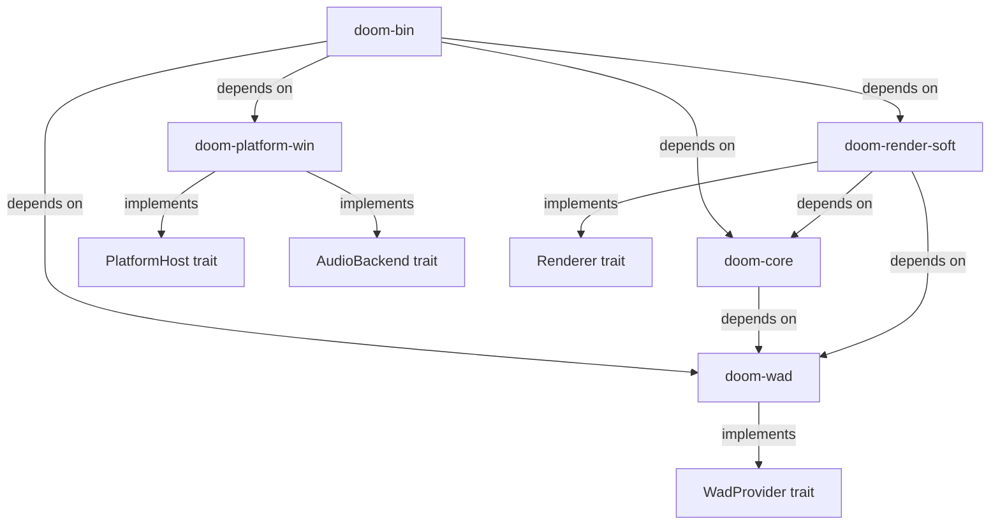

# DOOM Rust — DOOM 1.10 Ported to Rust for Windows 11

A faithful port of id Software's **DOOM 1.10** source code from ANSI C / Linux / X11 to
idiomatic **Rust** with native **Windows 11** support via **SDL2**. This project preserves
the original engine's deterministic gameplay loop, fixed-point arithmetic, BSP-based
software renderer, and 35 tic-per-second timing while replacing every Linux-specific
dependency with a modern, cross-platform backend.

Licensed under the [GNU General Public License v2.0](LICENSE.TXT).

> **Note:** This repository does **not** include any copyrighted game data. You must
> provide your own legally-owned IWAD file (e.g., `DOOM.WAD` or `DOOM2.WAD` purchased
> from [Steam](https://store.steampowered.com/) or another retailer) to play.

---

## Quick Start

### Prerequisites

| Requirement | Details |
|-------------|---------|
| **Operating System** | Windows 11 (22H2 or later) |
| **Rust Toolchain** | Install via [rustup.rs](https://rustup.rs) — select `stable-x86_64-pc-windows-msvc` |
| **C++ Build Tools** | [Visual Studio Build Tools 2022](https://visualstudio.microsoft.com/visual-cpp-build-tools/) with the **"Desktop development with C++"** workload (required by SDL2's `bundled` feature to compile the SDL2 C library from source) |
| **IWAD File** | A legally-owned DOOM IWAD file, such as `DOOM.WAD`, `DOOM2.WAD`, `TNT.WAD`, or `PLUTONIA.WAD` |

### Build

```bash
git clone <repository-url>
cd doom-rust
cargo build --release
```

The first build will take several minutes as SDL2 is compiled from source. Subsequent
builds are incremental and much faster.

### Run

```bash
cargo run --release -- --iwad "C:\Program Files (x86)\Steam\steamapps\common\Doom 2\base\DOOM2.WAD"
```

A window opens displaying the DOOM title screen. Use arrow keys to navigate the menu,
Enter to select, and Escape to return.

---

## Architecture

The project is organized as a **Cargo workspace** with five crates that enforce strict
module boundaries between deterministic game logic, platform services, and the executable
entry point.

| Crate | Description |
|-------|-------------|
| **`doom-wad`** | WAD/IWAD file parsing — lump directory, name lookup, and tag-based caching |
| **`doom-core`** | Deterministic game logic — types, game loop, play subsystems (collision, AI, specials), UI, renderer trait definitions, and utilities |
| **`doom-render-soft`** | BSP-based software renderer — column/span drawing, visplanes, sprite compositing |
| **`doom-platform-win`** | Windows 11 platform backend — SDL2 window, input, audio mixing, and high-resolution timing |
| **`doom-bin`** | Executable entry point — CLI argument parsing (clap), logging setup (tracing), platform initialization |

### Dependency Diagram



### Trait-Based Platform Abstraction

The boundary between portable game logic and platform-specific code is formalized through
four Rust traits. `doom-core` depends only on these trait interfaces — never on concrete
platform implementations — enabling future backend substitution (e.g., a Linux SDL2
backend or a pure-Rust winit + pixels + rodio stack) without modifying core game logic.

| Trait | Defined In | Implemented By | Replaces |
|-------|-----------|----------------|----------|
| `PlatformHost` | `doom-core` | `doom-platform-win` | `i_system.h` + `i_video.h` (timing, graphics, input) |
| `Renderer` | `doom-core` | `doom-render-soft` | `r_main.h` (BSP rendering entry point) |
| `AudioBackend` | `doom-core` | `doom-platform-win` | `i_sound.h` (SFX mixing, music playback) |
| `WadProvider` | `doom-wad` | `doom-wad` | `w_wad.h` (lump lookup, read, cache) |

---

## Key Features

- **Behavioral parity** with the original DOOM 1.10 engine — identical gameplay mechanics,
  collision detection, enemy AI, weapon behavior, and special map effects
- **Deterministic gameplay loop** running at the original 35 tics per second
- **Fixed-point 16.16 arithmetic** preserved exactly (`FRACBITS = 16`, `FRACUNIT = 65536`)
  for bit-identical results with the C implementation
- **IWAD compatibility** — loads unmodified WAD files from DOOM, DOOM II, TNT: Evilution,
  and The Plutonia Experiment
- **SDL2-based platform backend** for window creation, keyboard/mouse input, audio mixing,
  and high-resolution timing
- **Command-line interface** via `clap` with `--iwad`, `--pwad`, `--warp`, `--skill`, and
  `--verbose` flags
- **Structured diagnostics** via `tracing` and `tracing-subscriber`, configurable with the
  `RUST_LOG` environment variable
- **Safe Rust** — no `unsafe` code in game logic; all FFI is managed internally by the
  `sdl2-sys` crate
- **Deterministic PRNG** — original `rndtable[256]` lookup table preserved for demo
  playback compatibility

---

## CLI Usage

```
doom-rust [OPTIONS] --iwad <PATH>
```

| Flag | Required | Description |
|------|----------|-------------|
| `--iwad <path>` | **Yes** | Path to the IWAD file (DOOM.WAD, DOOM2.WAD, TNT.WAD, or PLUTONIA.WAD) |
| `--pwad <path>` | No | Path to a PWAD file (patch WAD for mods/custom levels) |
| `--warp <episode> <map>` | No | Warp directly to a specific map (e.g., `--warp 1 1` for E1M1) |
| `--skill <1-5>` | No | Set difficulty level (1 = I'm Too Young to Die, 5 = Nightmare!) |
| `--verbose` | No | Enable verbose diagnostic logging |

### Examples

```bash
# Launch DOOM II with default settings
cargo run --release -- --iwad "C:\Games\DOOM2.WAD"

# Warp to Episode 2, Map 3 on Ultra-Violence difficulty
cargo run --release -- --iwad "C:\Games\DOOM.WAD" --warp 2 3 --skill 4

# Load a PWAD mod with verbose logging
cargo run --release -- --iwad "C:\Games\DOOM2.WAD" --pwad "C:\Mods\mymod.wad" --verbose
```

---

## Controls

| Key | Action |
|-----|--------|
| Arrow Up | Move forward |
| Arrow Down | Move backward |
| Arrow Left | Turn left |
| Arrow Right | Turn right |
| Ctrl | Fire weapon |
| Space | Use / Open doors |
| Shift | Run |
| Tab | Toggle automap |
| Enter | Select menu item |
| Escape | Open / Close menu |
| F2 | Save game |
| F3 | Load game |
| F6 | Quick save |
| F9 | Quick load |
| 1–7 | Select weapon |

---

## Troubleshooting

### "IWAD not found" error

Verify the path to your WAD file is correct and the file exists. Common Steam installation
paths:

- **DOOM:** `C:\Program Files (x86)\Steam\steamapps\common\Ultimate Doom\base\DOOM.WAD`
- **DOOM II:** `C:\Program Files (x86)\Steam\steamapps\common\Doom 2\base\DOOM2.WAD`

Ensure the path is enclosed in quotes if it contains spaces.

### Build fails with "link.exe not found"

Install [Visual Studio Build Tools 2022](https://visualstudio.microsoft.com/visual-cpp-build-tools/)
with the **"Desktop development with C++"** workload. Restart your terminal after
installation.

### No audio output

1. Verify that your default audio device is working in Windows Sound Settings.
2. Check the console output for SDL2 audio initialization messages.
3. Try setting the environment variable `SDL_AUDIODRIVER=wasapi` before launching.

### Window does not appear

1. Ensure your graphics drivers are up to date.
2. SDL2 uses DirectX on Windows by default. If you experience issues, try setting
   `SDL_VIDEO_DRIVER=windows`.

### Game is sluggish

Ensure you built in **release** mode (`cargo build --release`). Debug builds are
significantly slower due to lack of optimizations and overflow checking.

---

## Documentation

| Document | Description |
|----------|-------------|
| [docs/BUILDING.md](docs/BUILDING.md) | Detailed Windows 11 build guide — from clean machine to playable DOOM |
| [docs/ARCHITECTURE.md](docs/ARCHITECTURE.md) | Architecture Decision Records — platform choice, crate design, fixed-point strategy |
| [docs/ISSUES.md](docs/ISSUES.md) | Issue Resolution Matrix — known issues, fixes, and deferred items |
| [README.TXT](README.TXT) | Original release notes by John Carmack (December 23, 1997) |

---

## Project History

This port is based on the DOOM source code released by **John Carmack** and **id Software**
on **December 23, 1997**. The original source code was cleaned up for public release by
Bernd Kreimeier. The original release targeted Linux with X11 display, OSS audio, and
Unix sockets for networking.

The original C source files are preserved unmodified in the following directories for
historical reference:

- `linuxdoom-1.10/` — Full Linux/X11 DOOM 1.10 engine (110 files)
- `sndserv/` — Standalone Linux sound server (9 files)
- `sersrc/` — DOS serial/modem networking (historical artifact, not ported)
- `ipx/` — DOS IPX multiplayer (historical artifact, not ported)

---

## License

This project is licensed under the **GNU General Public License v2.0**. See
[LICENSE.TXT](LICENSE.TXT) for the full license text.

Based on the DOOM source code by **id Software**, released by **John Carmack** on
December 23, 1997.

Copyright © ZeniMax Media Inc.
