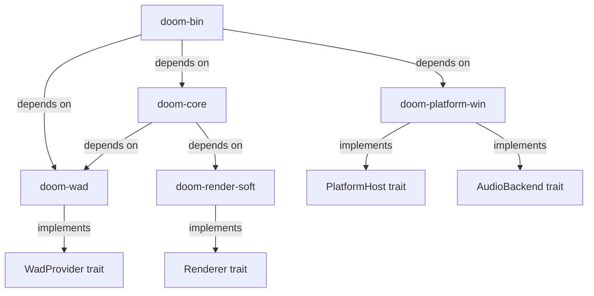

# Technical Specification

# 0. Agent Action Plan

## 0.1 Intent Clarification

### 0.1.1 Core Refactoring Objective

Based on the prompt, the Blitzy platform understands that the refactoring objective is to perform a **complete technology-stack migration** of the id Software DOOM 1.10 source code from its original ANSI C / Linux / X11 implementation to a modern **Rust** implementation with native **Windows 11** support.

- **Refactoring type**: Tech stack migration (C → Rust) combined with platform retargeting (Linux/X11 → Windows 11)
- **Target repository**: Same repository — the Rust Cargo workspace replaces the legacy C build tree in-place
- **Scope of migration**: The entire `linuxdoom-1.10/` engine tree (~110 source files), the standalone `sndserv/` sound server (9 files), and the root-level `README.TXT` / `LICENSE.TXT` documentation are in scope. The DOS-only `sersrc/` (serial networking) and `ipx/` (IPX multiplayer) directories are historical artifacts and will not be ported
- **Behavioral parity mandate**: The ported Rust engine must reproduce the deterministic gameplay loop, fixed-point arithmetic (16.16 via `fixed_t`), 35 tic/second timing, BSP-based rendering, WAD/IWAD loading semantics, and overall user experience of the original engine. All gameplay mechanics, including collision detection, enemy AI, weapon behavior, and special map effects, must be preserved exactly as-is unless a deviation is explicitly documented and justified

The refactoring goals, restated with technical precision:

- **G1 — Language migration**: Translate all C compilation units in `linuxdoom-1.10/` into idiomatic, safe Rust organized as a Cargo workspace with five crates: `doom-core`, `doom-wad`, `doom-render-soft`, `doom-platform-win`, and `doom-bin`
- **G2 — Windows 11 native runtime**: Replace every Linux/X11/OSS platform dependency (Xlib, XShm, `/dev/dsp`, Unix sockets, `gettimeofday`) with a Windows-native platform backend using SDL2 (bundled) for window management, input handling, audio output, and high-resolution timing
- **G3 — IWAD compatibility**: Preserve the WAD file format contract (`wadinfo_t`, `filelump_t`, `lumpinfo_t`) so that user-owned IWAD files from Steam (DOOM, DOOM II, TNT, Plutonia) load correctly without modification
- **G4 — Issue resolution**: Parse and triage all known incomplete work from `README.TXT` (the only documentation file present; `TODO`, `ChangeLog`, and `README.b` do not exist in this repository), producing an Issue Resolution Matrix with fix/defer disposition and evidence
- **G5 — Clean-machine build documentation**: Deliver step-by-step Windows 11 build and run instructions that take a developer from a freshly installed machine to a playable DOOM session using an owned IWAD file

Implicit requirements surfaced during analysis:

- The zone memory allocator (`z_zone.c/h`, 6 MB default heap) must be replaced with Rust's standard allocator while preserving the tag-based cache eviction semantics used by the WAD lump cache
- Assembly-optimized inner loops documented in `README.asm` (texture column drawing in `R_DrawColumn`, floor/ceiling spans in `R_DrawSpan`, fixed-point multiply/divide) must be reimplemented as safe Rust with equivalent numerical behavior
- The `SNDSERV` external-process audio model (communicating via `FILE*` pipes to a separate `sndserver` binary) must be replaced with an in-process audio solution, as the sound server architecture is Linux-specific
- All `#define NORMALUNIX` and `#define LINUX` preprocessor-guarded code paths represent Linux-specific behavior that must be replaced with Windows equivalents
- Demo playback and recording compatibility should be maintained to enable regression testing against known-good demo files

### 0.1.2 Technical Interpretation

This refactoring translates to the following technical transformation strategy:

**Current architecture** (monolithic C, Unix-coupled):
- Single flat directory of ~110 `.c`/`.h` files compiled via GNU Make
- Platform layer hardwired to Linux: X11 display (`i_video.c`), OSS audio (`i_sound.c`), Unix sockets (`i_net.c`), `gettimeofday` timing (`i_system.c`)
- No module boundaries — all translation units share global state through `extern` declarations
- Zone memory allocator manages a single `malloc`'d heap block
- Build produces a single `linuxxdoom` ELF binary

**Target architecture** (modular Rust Cargo workspace, Windows-native):
- Five Cargo crates with explicit dependency boundaries and trait-based platform abstraction
- Platform layer behind `PlatformHost`, `Renderer`, `AudioBackend`, and `WadProvider` traits
- Windows 11 backend implemented via SDL2 (`sdl2` crate with `bundled` feature) providing window creation, input polling, audio mixing, and precise timing
- Standard Rust allocator replaces zone memory; WAD lump caching uses Rust `HashMap` with reference-counted entries
- Build produces a Windows PE executable via `cargo build --release`
- CLI interface via `clap` with `--iwad`, `--pwad`, `--warp`, `--skill` arguments
- Structured diagnostics via `tracing` and `tracing-subscriber`

**Platform backend decision — SDL2 (recommended)**:

The user specified two candidate stacks: SDL2 or winit + pixels + rodio/cpal. After analysis, **SDL2 with the `bundled` feature** is the recommended choice for this migration phase:

- **Ecosystem alignment**: The DOOM source port community (Chocolate Doom, PrBoom+, Crispy Doom) standardizes on SDL2, providing proven reference implementations for audio mixing, input mapping, and palette-based rendering at 35 Hz
- **Integration simplicity**: SDL2 provides window, input, audio, and timing in a single library, eliminating the need to coordinate version compatibility across winit (0.30.13), pixels (0.15.0), and rodio (0.22.2) — a combination known to have `raw-window-handle` trait compatibility issues
- **Windows 11 support**: SDL2's `bundled` feature compiles the SDL2 C library from source during `cargo build`, making the build fully self-contained on Windows 11 without requiring pre-installed system libraries
- **Minimal FFI surface**: The `sdl2` Rust crate wraps SDL2 in safe Rust types; the only FFI is managed internally by `sdl2-sys`, and the trait-based architecture allows future replacement with a pure-Rust stack (winit + pixels + rodio) without modifying core game logic
- **Software rendering compatibility**: SDL2's `Surface` and `Texture` APIs support direct pixel buffer manipulation, which is exactly what DOOM's software renderer requires (writing palettized 320×200 frames that get scaled to the window)




## 0.2 Source Analysis

### 0.2.1 Comprehensive Source File Discovery

The DOOM 1.10 repository contains **4 directories** and **2 root files**, totaling approximately **130 source files** across the entire tree. The primary engine resides in `linuxdoom-1.10/` with **110 files** (55 `.c` implementation files and 55 `.h` headers). The repository is a faithful copy of the id Software public source release from December 23, 1997.

**Search patterns applied to identify all files requiring refactoring**:

- `linuxdoom-1.10/*.c` — All 55 C implementation files (primary migration targets)
- `linuxdoom-1.10/*.h` — All 55 C header files (interface contracts to be translated into Rust modules, traits, and structs)
- `linuxdoom-1.10/Makefile` — GNU Make build system (to be replaced by Cargo workspace)
- `linuxdoom-1.10/README.asm` — Assembly documentation (reference for inner-loop reimplementation)
- `sndserv/*` — 9 files comprising the standalone sound server (to be absorbed into `doom-platform-win`)
- `sersrc/*` — 8 DOS serial networking files (historical reference only, not ported)
- `ipx/*` — 7 DOS IPX multiplayer files (historical reference only, not ported)
- `README.TXT` — John Carmack's release notes (to be preserved and augmented)
- `LICENSE.TXT` — GPL v2 license (to be preserved)

**No TODO, ChangeLog, or README.b files exist in this repository.** A comprehensive search confirmed their absence. The only documentation files present are `README.TXT` (root), `README.asm` (linuxdoom-1.10/), and `sersrc/README.TXT`.

**No TODO, FIXME, HACK, XXX, or BUG annotations** were found in any source file comments.

### 0.2.2 Current Structure Mapping

```
Repository Root:
├── LICENSE.TXT                          (GPL v2 license)
├── README.TXT                           (Carmack release notes, Dec 1997)
├── linuxdoom-1.10/                      (Main engine — 110 files)
│   ├── Makefile                         (GNU Make: gcc, -DNORMALUNIX -DLINUX, links X11/Xext/nsl/m)
│   ├── README.asm                       (Assembly inner-loop documentation)
│   │
│   ├── [Platform Abstraction Layer — 9 files]
│   │   ├── i_main.c                     (Entry point: sets argc/argv, calls D_DoomMain)
│   │   ├── i_system.c / i_system.h      (Timing via gettimeofday, 6MB zone alloc, I_Error, I_Quit)
│   │   ├── i_video.c  / i_video.h       (X11/Xlib display, MIT-SHM, 320x200 palettized, keyboard/mouse)
│   │   ├── i_sound.c  / i_sound.h       (Linux OSS audio, SNDSERV pipe model, SFX + Music APIs)
│   │   └── i_net.c    / i_net.h         (Unix UDP sockets, doomcom_t shared control block)
│   │
│   ├── [Core Definitions & Types — 22 files]
│   │   ├── doomdef.c  / doomdef.h       (VERSION=110, GameMode_t, SCREEN 320x200, TICRATE=35, MAXPLAYERS=4)
│   │   ├── doomtype.h                   (boolean, byte, MAXCHAR/MAXSHORT/MAXINT/MAXLONG)
│   │   ├── doomstat.c / doomstat.h      (Global game state variables)
│   │   ├── doomdata.h                   (Map data structures: mapvertex_t, maplinedef_t, etc.)
│   │   ├── d_event.h                    (Event types: ev_keydown, ev_mouse, ev_joystick)
│   │   ├── d_items.c  / d_items.h       (Weapon info table)
│   │   ├── d_main.c   / d_main.h        (D_DoomMain, D_DoomLoop, WAD loading, game flow control)
│   │   ├── d_net.c    / d_net.h         (Network protocol: doomcom_t, doomdata_t, tic sync)
│   │   ├── d_player.h                   (Player state: player_t with health, armor, weapons, powers)
│   │   ├── d_textur.h                   (Texture composition: mappatch_t, maptexture_t)
│   │   ├── d_think.h                    (Thinker linked list: thinker_t, actionf_t union)
│   │   ├── d_ticcmd.h                   (Tic command: forwardmove, sidemove, angleturn, buttons)
│   │   ├── dstrings.c / dstrings.h      (String table, localization dispatch)
│   │   ├── d_englsh.h                   (English text strings)
│   │   └── d_french.h                   (French text strings)
│   │
│   ├── [Game Logic — 26 files]
│   │   ├── g_game.c   / g_game.h        (Game control: new game, save/load, demo, level flow)
│   │   ├── p_ceilng.c                   (Ceiling movement specials)
│   │   ├── p_doors.c                    (Door open/close specials)
│   │   ├── p_enemy.c                    (Monster AI: chase, attack, boss actions)
│   │   ├── p_floor.c                    (Floor movement specials)
│   │   ├── p_inter.c  / p_inter.h       (Pickups, damage, kills, player interaction)
│   │   ├── p_lights.c                   (Light flicker, glow, strobe specials)
│   │   ├── p_local.h                    (Play subsystem umbrella header)
│   │   ├── p_map.c                      (Movement, collision, line traces, teleport)
│   │   ├── p_maputl.c                   (Map geometry utilities, intercept traversal)
│   │   ├── p_mobj.c   / p_mobj.h        (World objects: spawn, physics, state machine)
│   │   ├── p_plats.c                    (Platform lift specials)
│   │   ├── p_pspr.c   / p_pspr.h        (Player weapon sprites, attack actions)
│   │   ├── p_saveg.c  / p_saveg.h       (Save/load game serialization)
│   │   ├── p_setup.c  / p_setup.h       (Map loading from WAD lumps)
│   │   ├── p_sight.c                    (Line-of-sight checks)
│   │   ├── p_spec.c   / p_spec.h        (Map specials: animations, switches, triggers)
│   │   ├── p_switch.c                   (Switch texture change specials)
│   │   ├── p_telept.c                   (Teleport specials)
│   │   ├── p_tick.c   / p_tick.h        (Thinker loop, per-tic simulation driver)
│   │   └── p_user.c                     (Player input → movement/view processing)
│   │
│   ├── [Renderer — 22 files]
│   │   ├── r_bsp.c    / r_bsp.h         (BSP tree traversal, subsector rendering)
│   │   ├── r_data.c   / r_data.h        (Texture/flat/sprite cache, colormap loading)
│   │   ├── r_defs.h                     (Renderer type definitions: vertex_t, seg_t, sector_t, etc.)
│   │   ├── r_draw.c   / r_draw.h        (Column and span drawing primitives)
│   │   ├── r_local.h                    (Renderer umbrella header, includes all r_*.h)
│   │   ├── r_main.c   / r_main.h        (Renderer entry: R_RenderPlayerView, viewpoint setup, lighting LUTs)
│   │   ├── r_plane.c  / r_plane.h       (Visplane allocation, floor/ceiling rendering)
│   │   ├── r_segs.c   / r_segs.h        (Wall segment rendering, texture mapping)
│   │   ├── r_sky.c    / r_sky.h         (Sky texture rendering)
│   │   ├── r_state.h                    (Renderer global state externs)
│   │   └── r_things.c / r_things.h      (Sprite sorting, masked column drawing)
│   │
│   ├── [Sound System — 4 files]
│   │   ├── s_sound.c  / s_sound.h       (High-level sound API: positional SFX, music, channel mixing)
│   │   └── sounds.c   / sounds.h        (Sound effect and music info tables)
│   │
│   ├── [UI / Presentation — 20 files]
│   │   ├── am_map.c   / am_map.h        (Automap overlay)
│   │   ├── f_finale.c / f_finale.h      (Ending text, bunny scroll, cast call)
│   │   ├── f_wipe.c   / f_wipe.h        (Screen wipe transitions)
│   │   ├── hu_lib.c   / hu_lib.h        (HUD widget library: text lines, input lines)
│   │   ├── hu_stuff.c / hu_stuff.h      (HUD management: messages, chat, titles)
│   │   ├── m_menu.c   / m_menu.h        (In-game menu system)
│   │   ├── st_lib.c   / st_lib.h        (Status bar widget library)
│   │   ├── st_stuff.c / st_stuff.h      (Status bar: health, ammo, face, keys)
│   │   ├── v_video.c  / v_video.h       (Video buffer: 5 screens, patch/block drawing, gamma)
│   │   └── wi_stuff.c / wi_stuff.h      (Intermission: stats, world map)
│   │
│   ├── [Utilities — 16 files]
│   │   ├── m_argv.c   / m_argv.h        (Command-line argument parser)
│   │   ├── m_bbox.c   / m_bbox.h        (Bounding box utilities)
│   │   ├── m_cheat.c  / m_cheat.h       (Cheat code sequence detector)
│   │   ├── m_fixed.c  / m_fixed.h       (Fixed-point 16.16: FixedMul, FixedDiv, FixedDiv2)
│   │   ├── m_misc.c   / m_misc.h        (File I/O, config defaults, screenshots)
│   │   ├── m_random.c / m_random.h      (Deterministic PRNG table)
│   │   ├── m_swap.c   / m_swap.h        (Endian byte-swap utilities)
│   │   └── z_zone.c   / z_zone.h        (Zone memory allocator: tag-based alloc/free/purge)
│   │
│   ├── [WAD System — 2 files]
│   │   └── w_wad.c    / w_wad.h         (WAD file loader: lump directory, cache, multi-file support)
│   │
│   └── [Data Tables — 4 files]
│       ├── info.c     / info.h           (Sprite names, states, mobjinfo — massive data tables)
│       └── tables.c   / tables.h         (Trigonometric lookup tables: finesine, finetangent, tantoangle)
│
├── sndserv/                              (Standalone sound server — 9 files)
│   ├── Makefile                          (Builds sndserver binary)
│   ├── linux.c                           (OSS /dev/dsp backend)
│   ├── sounds.c  / sounds.h             (Sound info tables)
│   ├── soundsrv.c / soundsrv.h          (Server main loop: reads commands from stdin pipe)
│   ├── soundst.h                         (Shared sound state types)
│   └── wadread.c  / wadread.h            (Minimal WAD reader for extracting sound lumps)
│
├── sersrc/                               (DOS serial/modem networking — 8 files, HISTORICAL ONLY)
│   ├── SERSETUP.C / SERSETUP.H          (Serial port game setup)
│   ├── DOOMNET.C  / DOOMNET.H           (Network adapter interface)
│   ├── PORT.C                            (Serial port I/O)
│   ├── SERSTR.H / SER_FRCH.H            (String tables)
│   └── README.TXT                        (Serial networking documentation)
│
└── ipx/                                  (DOS IPX multiplayer — 7 files, HISTORICAL ONLY)
    ├── IPXSETUP.C                        (IPX game setup entry)
    ├── IPXNET.C   / IPXNET.H            (IPX protocol implementation)
    ├── DOOMNET.C  / DOOMNET.H           (Network adapter interface)
    └── IPXSTR.H   / IPX_FRCH.H          (String tables)
```

### 0.2.3 Key Engine Constants and Contracts

These constants define the behavioral contract that must be preserved exactly in the Rust port:

| Constant | Value | Source File | Significance |
|----------|-------|-------------|--------------|
| `VERSION` | 110 | `doomdef.h` | Engine version identifier |
| `SCREENWIDTH` | 320 | `doomdef.h` | Native render buffer width in pixels |
| `SCREENHEIGHT` | 200 | `doomdef.h` | Native render buffer height in pixels |
| `TICRATE` | 35 | `doomdef.h` | Game simulation ticks per second |
| `MAXPLAYERS` | 4 | `doomdef.h` | Maximum simultaneous players |
| `FRACBITS` | 16 | `m_fixed.h` | Fixed-point fractional bit count |
| `FRACUNIT` | 65536 | `m_fixed.h` | Fixed-point unit value (1 << 16) |
| `MAXWADFILES` | 20 | `d_main.h` | Maximum WAD files loadable |
| `BACKUPTICS` | 12 | `d_net.h` | Network tic backup buffer depth |
| `MAXNETNODES` | 8 | `d_net.h` | Maximum network peer nodes |
| `DOOMCOM_ID` | 0x12345678 | `d_net.h` | Network control block magic number |
| `LIGHTLEVELS` | 16 | `r_main.h` | Diminishing lighting gradations |
| `NUMCOLORMAPS` | 32 | `r_main.h` | Colormap LUT entries in COLORMAP lump |
| `MAXLIGHTSCALE` | 48 | `r_main.h` | Maximum light scaling steps |
| `MAXLIGHTZ` | 128 | `r_main.h` | Maximum depth-based light steps |

### 0.2.4 Platform Dependency Inventory (Linux-Specific Code to Replace)

| Source File | Linux Dependency | Replacement Strategy (Windows 11) |
|-------------|-----------------|----------------------------------|
| `i_video.c` | X11/Xlib, MIT-SHM extension, XEvent keyboard/mouse | SDL2 `Window`, `Canvas`, `EventPump` |
| `i_sound.c` | OSS `/dev/dsp`, `SNDSERV` pipe to external `sndserver` process | SDL2 `AudioDevice` with callback-based mixing |
| `i_system.c` | `gettimeofday()` for timing, `malloc` for 6 MB zone | `std::time::Instant` or SDL2 `timer`, Rust standard allocator |
| `i_net.c` | Unix UDP sockets (`socket`, `bind`, `sendto`, `recvfrom`) | Windows Winsock2 via `std::net::UdpSocket` (or defer networking) |
| `i_main.c` | Unix `main(argc, argv)` entry | Rust `fn main()` with `clap` argument parsing |
| `Makefile` | GCC, `-DNORMALUNIX -DLINUX`, `-lXext -lX11 -lnsl -lm` | `Cargo.toml` workspace with `cargo build` |
| `sndserv/*` | OSS `/dev/dsp`, Unix pipe IPC (`stdin`/`stdout`) | Absorbed into `doom-platform-win` SDL2 audio backend |
| `m_misc.c` | Unix file paths (`/home/`, `/usr/local/share/`), `mkdir` | Windows `std::fs`, `dirs` crate for known folders |


## 0.3 Scope Boundaries

### 0.3.1 Exhaustively In Scope

**Source transformations (C → Rust translation)**:
- `linuxdoom-1.10/*.c` — All 55 C implementation files translated into Rust modules across 5 crates
- `linuxdoom-1.10/*.h` — All 55 C header files translated into Rust type definitions, trait declarations, and module interfaces
- `linuxdoom-1.10/Makefile` — Replaced by `Cargo.toml` workspace configuration
- `linuxdoom-1.10/README.asm` — Assembly inner loops reimplemented as safe Rust (preserved as historical reference)
- `sndserv/*.c`, `sndserv/*.h` — Sound server logic absorbed into `doom-platform-win` crate's audio backend
- `sndserv/Makefile` — Eliminated (no separate binary needed)

**New Rust workspace structure (all files to be created)**:
- `Cargo.toml` — Root workspace manifest
- `doom-core/Cargo.toml`, `doom-core/src/**/*.rs` — Deterministic game logic crate
- `doom-wad/Cargo.toml`, `doom-wad/src/**/*.rs` — WAD/IWAD parsing crate
- `doom-render-soft/Cargo.toml`, `doom-render-soft/src/**/*.rs` — Software renderer crate
- `doom-platform-win/Cargo.toml`, `doom-platform-win/src/**/*.rs` — Windows 11 platform backend crate
- `doom-bin/Cargo.toml`, `doom-bin/src/**/*.rs` — Executable binary crate

**Configuration and build infrastructure**:
- `Cargo.toml` — Root workspace definition with member crates
- `doom-*/Cargo.toml` — Per-crate dependency manifests
- `.cargo/config.toml` — Cargo build configuration for Windows targets
- `rust-toolchain.toml` — Rust toolchain pinning (stable channel)
- `.github/workflows/ci.yml` — CI pipeline for Windows build, lint, test
- `clippy.toml` — Clippy lint configuration
- `rustfmt.toml` — Code formatting configuration

**Testing**:
- `doom-wad/tests/**/*.rs` — WAD parsing unit and integration tests
- `doom-core/tests/**/*.rs` — Game state, math utility, and PRNG tests
- `doom-render-soft/tests/**/*.rs` — Renderer math and lookup table tests
- `doom-platform-win/tests/**/*.rs` — Platform backend smoke tests
- `doom-bin/tests/**/*.rs` — CLI argument parsing and executable launch tests

**Documentation**:
- `README.md` — New top-level project README with Windows 11 build/run instructions
- `docs/BUILDING.md` — Detailed build guide for Windows 11
- `docs/ARCHITECTURE.md` — Architecture Decision Records (ADRs)
- `docs/ISSUES.md` — Issue Resolution Matrix
- `README.TXT` — Original Carmack release notes (preserved unmodified)
- `LICENSE.TXT` — GPL v2 license (preserved unmodified)

**Import and reference corrections**:
- Every Rust source file will use `use` statements referencing the new crate/module structure
- Cross-crate dependencies expressed via `Cargo.toml` `[dependencies]` sections
- No file in the Rust workspace will reference the old C file paths

### 0.3.2 Explicitly Out of Scope

- **Linux runtime support** — Per the user's directive: "Linux support is explicitly out of scope for this phase." The platform crate targets Windows 11 only. The trait-based architecture preserves the ability to add a Linux backend in the future without modifying core game logic
- **`sersrc/` directory** — DOS serial/modem networking (`SERSETUP.C`, `DOOMNET.C`, `PORT.C`, etc.). These are 16-bit DOS real-mode artifacts with no relevance to modern Windows networking
- **`ipx/` directory** — DOS IPX multiplayer (`IPXSETUP.C`, `IPXNET.C`, etc.). IPX/SPX protocol support is deprecated and not available on Windows 11
- **Multiplayer networking implementation** — While the network protocol structures (`doomcom_t`, `doomdata_t`) will be translated into Rust types for completeness, implementing a functional multiplayer networking stack is deferred. The `i_net.c` UDP socket code will be stubbed with a single-player-only implementation
- **3D hardware-accelerated rendering** — The migration preserves the original software renderer. OpenGL, Vulkan, or DirectX 3D rendering backends are out of scope
- **Gameplay enhancements** — No new features (transparency, slopes, jumping, ducking, look-up/down) as suggested in Carmack's README.TXT. The Minimal Change Clause mandates behavioral parity
- **IWAD redistribution** — No copyrighted game data files will be included in the repository or binaries. Users must provide their own IWAD files
- **macOS, mobile, or web targets** — Only Windows 11 x86_64 is targeted in this phase
- **Performance optimization beyond correctness** — Optimization will only be performed where required for correct behavior (e.g., achieving 35 tics/second). No speculative optimization
- **Modification of historical/reference files** — `sersrc/README.TXT` and the source files in `sersrc/` and `ipx/` directories will not be modified. They are preserved as historical artifacts


## 0.4 Target Design

### 0.4.1 Refactored Structure Planning

The target architecture is a Cargo workspace with five crates, organized to enforce strict module boundaries between deterministic game logic, platform services, and the executable entry point. Every file and folder listed below is required for a standalone, buildable Windows 11 application.

```
Target Repository Root:
├── Cargo.toml                                (Workspace manifest)
├── rust-toolchain.toml                       (Pin to stable Rust channel)
├── clippy.toml                               (Clippy lint configuration)
├── rustfmt.toml                              (Code formatting rules)
├── .cargo/
│   └── config.toml                           (Windows target defaults, linker settings)
├── .github/
│   └── workflows/
│       └── ci.yml                            (Windows CI: fmt, clippy, test, build)
│
├── doom-wad/                                 (WAD/IWAD parsing library)
│   ├── Cargo.toml
│   └── src/
│       ├── lib.rs                            (Crate root, public API)
│       ├── types.rs                          (WadInfo, FileLump, LumpInfo, WadType enum)
│       ├── wad_file.rs                       (WAD file loading, lump directory construction)
│       ├── lump_cache.rs                     (Lump caching with tag-based eviction)
│       ├── wad_provider.rs                   (WadProvider trait definition)
│       └── tests/
│           ├── wad_header_tests.rs           (WAD identification parsing)
│           └── lump_tests.rs                 (Lump lookup, name matching)
│
├── doom-core/                                (Deterministic game logic)
│   ├── Cargo.toml
│   └── src/
│       ├── lib.rs                            (Crate root, re-exports)
│       ├── types/
│       │   ├── mod.rs                        (Type module root)
│       │   ├── fixed.rs                      (fixed_t: i32 newtype, FixedMul, FixedDiv, FRACBITS=16)
│       │   ├── angle.rs                      (angle_t, ANG45/90/180/270 constants)
│       │   ├── tables.rs                     (finesine, finetangent, tantoangle lookup tables)
│       │   ├── doomdef.rs                    (GameMode, GameMission, GameState, Skill, constants)
│       │   ├── doomtype.rs                   (Basic type aliases)
│       │   ├── ticcmd.rs                     (TicCmd: forwardmove, sidemove, angleturn, buttons)
│       │   ├── event.rs                      (Event enum: KeyDown, KeyUp, Mouse, Joystick)
│       │   ├── player.rs                     (Player struct: health, armor, weapons, powers, state)
│       │   ├── mobj.rs                       (MapObject: position, momentum, state, flags, info)
│       │   ├── thinker.rs                    (Thinker linked list, ActionFn union equivalent)
│       │   ├── map_data.rs                   (Vertex, LineDef, SideDef, Sector, Seg, Subsector, Node)
│       │   └── net.rs                        (DoomCom, DoomData network structures)
│       ├── info/
│       │   ├── mod.rs                        (Info module root)
│       │   ├── states.rs                     (State table: state_t array)
│       │   ├── sprites.rs                    (Sprite name table)
│       │   ├── mobjinfo.rs                   (MobjInfo table: health, speed, radius, etc.)
│       │   └── sounds.rs                     (Sound effect and music info enums/tables)
│       ├── game/
│       │   ├── mod.rs                        (Game module root)
│       │   ├── game_main.rs                  (D_DoomMain equivalent: init, WAD loading, game flow)
│       │   ├── game_loop.rs                  (D_DoomLoop: tic timing, event dispatch)
│       │   ├── game_ctrl.rs                  (G_Game: new game, save/load, demo, level transitions)
│       │   ├── game_net.rs                   (D_Net: NetUpdate, TryRunTics — stub for single-player)
│       │   └── strings.rs                    (Localized string tables: English, French)
│       ├── play/
│       │   ├── mod.rs                        (Play subsystem root)
│       │   ├── setup.rs                      (P_SetupLevel: map loading from WAD lumps)
│       │   ├── tick.rs                       (P_Ticker: thinker loop driver)
│       │   ├── mobj.rs                       (P_SpawnMobj, P_RemoveMobj, P_MobjThinker)
│       │   ├── movement.rs                   (P_XYMovement, P_ZMovement, P_TryMove)
│       │   ├── map.rs                        (P_PathTraverse, P_LineOpening, collision)
│       │   ├── maputl.rs                     (P_PointOnLineSide, P_BoxOnLineSide, intercepts)
│       │   ├── user.rs                       (P_PlayerThink, P_CalcHeight, movement from input)
│       │   ├── pspr.rs                       (P_SetupPsprites, weapon attack logic)
│       │   ├── inter.rs                      (P_TouchSpecialThing, P_DamageMobj, pickups)
│       │   ├── enemy.rs                      (A_Chase, A_Look, A_FaceTarget, boss specials)
│       │   ├── sight.rs                      (P_CheckSight line-of-sight)
│       │   ├── spec.rs                       (P_SpawnSpecials, animation tables, triggers)
│       │   ├── ceilng.rs                     (Ceiling movement thinkers)
│       │   ├── doors.rs                      (Door open/close thinkers)
│       │   ├── floor.rs                      (Floor movement thinkers)
│       │   ├── lights.rs                     (Light effect thinkers)
│       │   ├── plats.rs                      (Platform lift thinkers)
│       │   ├── switch.rs                     (Switch texture change logic)
│       │   ├── telept.rs                     (Teleport specials)
│       │   └── saveg.rs                      (Save/load game serialization)
│       ├── ui/
│       │   ├── mod.rs                        (UI module root)
│       │   ├── menu.rs                       (M_Menu: in-game control panel)
│       │   ├── hud.rs                        (HU_Stuff: messages, chat, titles)
│       │   ├── hud_lib.rs                    (HU_Lib: text line/input line widgets)
│       │   ├── statusbar.rs                  (ST_Stuff: status bar, face, keys)
│       │   ├── statusbar_lib.rs              (ST_Lib: status bar widget primitives)
│       │   ├── intermission.rs               (WI_Stuff: stats, world map screens)
│       │   ├── automap.rs                    (AM_Map: automap overlay)
│       │   ├── finale.rs                     (F_Finale: ending text, bunny, cast call)
│       │   └── wipe.rs                       (F_Wipe: screen wipe transitions)
│       ├── video/
│       │   ├── mod.rs                        (Video module root)
│       │   └── video.rs                      (V_Video: screen buffers, patch/block drawing, gamma)
│       ├── util/
│       │   ├── mod.rs                        (Utility module root)
│       │   ├── argv.rs                       (Command-line argument parsing utilities)
│       │   ├── bbox.rs                       (Bounding box operations)
│       │   ├── cheat.rs                      (Cheat code sequence detection)
│       │   ├── misc.rs                       (File I/O, config defaults, screenshots)
│       │   ├── random.rs                     (Deterministic PRNG: M_Random, P_Random tables)
│       │   └── swap.rs                       (Endian byte-swap utilities)
│       └── traits/
│           ├── mod.rs                        (Trait definitions root)
│           ├── platform.rs                   (PlatformHost trait: window, input, timing, filesystem)
│           ├── renderer.rs                   (Renderer trait: frame begin/end, palette)
│           ├── audio.rs                      (AudioBackend trait: SFX start/stop, music play/pause)
│           └── wad.rs                        (Re-export of WadProvider from doom-wad)
│
├── doom-render-soft/                         (Software renderer)
│   ├── Cargo.toml
│   └── src/
│       ├── lib.rs                            (Crate root, Renderer trait impl)
│       ├── bsp.rs                            (R_BSP: BSP tree traversal)
│       ├── data.rs                           (R_Data: texture/flat/sprite/colormap cache)
│       ├── draw.rs                           (R_Draw: column and span drawing primitives)
│       ├── main.rs                           (R_Main: R_RenderPlayerView, viewpoint, lighting LUTs)
│       ├── plane.rs                          (R_Plane: visplane alloc, floor/ceiling rendering)
│       ├── segs.rs                           (R_Segs: wall segment rendering, texture mapping)
│       ├── sky.rs                            (R_Sky: sky texture rendering)
│       ├── things.rs                         (R_Things: sprite sorting, masked column compositing)
│       └── defs.rs                           (Renderer-internal type definitions)
│
├── doom-platform-win/                        (Windows 11 platform backend)
│   ├── Cargo.toml
│   └── src/
│       ├── lib.rs                            (Crate root, PlatformHost trait impl)
│       ├── window.rs                         (SDL2 window creation, event loop, input mapping)
│       ├── video.rs                          (SDL2 texture/canvas for 320x200 → window scaling)
│       ├── audio.rs                          (SDL2 audio device, SFX mixing, music playback)
│       ├── timer.rs                          (High-resolution timing for tic synchronization)
│       ├── filesystem.rs                     (Windows file paths, IWAD discovery, config dirs)
│       └── input.rs                          (Keyboard/mouse input translation to Event enum)
│
├── doom-bin/                                 (Executable entry point)
│   ├── Cargo.toml
│   └── src/
│       ├── main.rs                           (fn main: CLI parsing, platform init, D_DoomMain call)
│       └── cli.rs                            (Clap CLI definition: --iwad, --pwad, --warp, --skill)
│
├── docs/
│   ├── BUILDING.md                           (Windows 11 build guide: prerequisites → playable game)
│   ├── ARCHITECTURE.md                       (ADRs: platform choice, rendering, audio, CLI)
│   └── ISSUES.md                             (Issue Resolution Matrix)
│
├── README.md                                 (Project overview, quick start, "Run DOOM on Windows 11")
├── README.TXT                                (Original Carmack release notes — preserved)
├── LICENSE.TXT                               (GPL v2 — preserved)
│
├── linuxdoom-1.10/                           (Original C source — preserved as reference)
│   └── [all original files unchanged]
├── sndserv/                                  (Original sound server — preserved as reference)
│   └── [all original files unchanged]
├── sersrc/                                   (DOS serial networking — preserved as reference)
│   └── [all original files unchanged]
└── ipx/                                      (DOS IPX multiplayer — preserved as reference)
    └── [all original files unchanged]
```

### 0.4.2 Web Search Research Conducted

Research was conducted on the following topics to inform the target design:

- **SDL2 Rust crate** (sdl2 0.37.0): The `bundled` feature compiles SDL2 from source, providing self-contained Windows builds. The crate provides window management, input handling, audio playback, and timer facilities through safe Rust wrappers. Recommended for game development at fixed tick rates
- **winit + pixels + rodio alternative**: winit 0.30.13 provides cross-platform windowing; pixels 0.15.0 provides GPU-accelerated pixel framebuffers via wgpu; rodio 0.22.2 provides audio playback via cpal. However, known `raw-window-handle` trait compatibility issues between these crates and the need to coordinate three separate libraries increases integration risk
- **clap 4.6.0**: Derive-based CLI parsing with automatic `--help` and `--version` generation. Supports typed arguments, default values, and value validation
- **tracing 0.1 + tracing-subscriber 0.3**: Structured diagnostic logging framework with configurable output formatting and filtering via `RUST_LOG` environment variable
- **Rust fixed-point arithmetic**: The standard library does not include fixed-point types. The `fixed_t = i32` newtype pattern with manual shift/multiply operations is the idiomatic approach for preserving DOOM's 16.16 arithmetic exactly

### 0.4.3 Design Pattern Applications

- **Trait-based platform abstraction**: `PlatformHost`, `Renderer`, `AudioBackend`, and `WadProvider` traits define the boundary between portable game logic and platform-specific code. This is the Rust equivalent of DOOM's original `i_*.h` interface headers, enabling future backend substitution without modifying `doom-core`
- **Newtype pattern for domain types**: `Fixed(i32)` wrapping the raw 16.16 value, `Angle(u32)` for BAM angles, `LumpNum(i32)` for lump indices. This prevents accidental mixing of integer types and enables method implementations on domain values
- **Module-per-subsystem organization**: Each `p_*.c` file maps to a corresponding module in `doom-core/src/play/`, maintaining the original code's logical grouping while adding Rust visibility controls
- **Crate-level dependency boundaries**: `doom-core` has no dependency on `doom-platform-win` or SDL2. Platform-specific code exists only in `doom-platform-win`. The `doom-bin` crate wires them together at the application level
- **Deterministic game state**: All game logic in `doom-core` uses only deterministic inputs (`TicCmd`) and deterministic PRNG (`M_Random`, `P_Random` tables). No platform-dependent state leaks into the gameplay layer

### 0.4.4 Run DOOM on Windows 11

The following provides the canonical instructions for building and running DOOM on Windows 11 from a clean machine:

**Prerequisites**:
- Windows 11 (22H2 or later)
- Rust toolchain: install via [rustup.rs](https://rustup.rs) (`rustup-init.exe`, select default stable-x86_64-pc-windows-msvc)
- Visual Studio Build Tools 2022 (C++ workload) — required by SDL2 `bundled` feature for C compilation
- A legally-owned DOOM IWAD file (e.g., `DOOM.WAD` or `DOOM2.WAD` from Steam)

**Build**:
```
git clone <repository-url>
cd doom-rust
cargo build --release
```

**Run**:
```
cargo run --release -- --iwad "C:\Program Files (x86)\Steam\steamapps\common\Doom 2\base\DOOM2.WAD"
```

**Expected output**: A window opens displaying the DOOM title screen. The game responds to keyboard input (arrow keys for movement, Ctrl to fire, Space to open doors, Enter to select menu items, Escape for the menu). Audio playback of music and sound effects functions correctly.

**Troubleshooting**:
- **"IWAD not found" error**: Verify the path to your WAD file. Common Steam locations include `C:\Program Files (x86)\Steam\steamapps\common\Ultimate Doom\base\DOOM.WAD` and `C:\Program Files (x86)\Steam\steamapps\common\Doom 2\base\DOOM2.WAD`
- **Build fails with "link.exe not found"**: Install Visual Studio Build Tools 2022 with the "Desktop development with C++" workload
- **No audio output**: Verify that your default audio device is working in Windows Sound Settings. Check that SDL2 audio initialized successfully in the console output
- **Window does not appear**: Ensure your graphics driver is up to date. SDL2 uses DirectX on Windows by default; set `SDL_VIDEO_DRIVER=windows` environment variable if needed


## 0.5 Transformation Mapping

### 0.5.1 File-by-File Transformation Plan

The entire refactor is executed in **ONE phase**. Every source file is mapped below. The Transformation column uses: **CREATE** (new Rust file from C source), **UPDATE** (modify existing file), and **REFERENCE** (use as behavioral reference only).

**Workspace Root Configuration Files**:

| Target File | Transformation | Source File | Key Changes |
|------------|---------------|-------------|-------------|
| Cargo.toml | CREATE | linuxdoom-1.10/Makefile | Workspace manifest with 5 member crates, replaces Make build |
| rust-toolchain.toml | CREATE | — | Pin stable Rust channel |
| clippy.toml | CREATE | — | Lint configuration for the project |
| rustfmt.toml | CREATE | — | Code formatting rules |
| .cargo/config.toml | CREATE | — | Windows MSVC target defaults |
| .github/workflows/ci.yml | CREATE | — | CI: cargo fmt, clippy, test, build on Windows |
| README.md | CREATE | README.TXT | New project README with build/run instructions |
| docs/BUILDING.md | CREATE | — | Detailed Windows 11 build guide |
| docs/ARCHITECTURE.md | CREATE | — | Architecture Decision Records |
| docs/ISSUES.md | CREATE | README.TXT | Issue Resolution Matrix |

**doom-wad Crate (WAD/IWAD Parsing)**:

| Target File | Transformation | Source File | Key Changes |
|------------|---------------|-------------|-------------|
| doom-wad/Cargo.toml | CREATE | — | Crate manifest with no platform dependencies |
| doom-wad/src/lib.rs | CREATE | linuxdoom-1.10/w_wad.h | Crate root, public API exports |
| doom-wad/src/types.rs | CREATE | linuxdoom-1.10/w_wad.h | WadInfo, FileLump, LumpInfo structs from wadinfo_t, filelump_t, lumpinfo_t |
| doom-wad/src/wad_file.rs | CREATE | linuxdoom-1.10/w_wad.c | W_InitMultipleFiles, W_CheckNumForName, W_GetNumForName, W_LumpLength, W_ReadLump |
| doom-wad/src/lump_cache.rs | CREATE | linuxdoom-1.10/w_wad.c | W_CacheLumpNum, W_CacheLumpName — HashMap-based cache replacing lumpcache/z_zone |
| doom-wad/src/wad_provider.rs | CREATE | linuxdoom-1.10/w_wad.h | WadProvider trait: lump lookup, read, cache interface |
| doom-wad/tests/wad_header_tests.rs | CREATE | linuxdoom-1.10/w_wad.c | Unit tests for IWAD/PWAD identification and header parsing |
| doom-wad/tests/lump_tests.rs | CREATE | linuxdoom-1.10/w_wad.c | Unit tests for lump name lookup and 8-char matching |

**doom-core Crate — Types Module**:

| Target File | Transformation | Source File | Key Changes |
|------------|---------------|-------------|-------------|
| doom-core/Cargo.toml | CREATE | — | Crate manifest, depends on doom-wad |
| doom-core/src/lib.rs | CREATE | — | Crate root, module declarations, re-exports |
| doom-core/src/types/mod.rs | CREATE | — | Type module root |
| doom-core/src/types/fixed.rs | CREATE | linuxdoom-1.10/m_fixed.h, linuxdoom-1.10/m_fixed.c | Fixed newtype(i32), FRACBITS=16, FixedMul, FixedDiv, FixedDiv2 |
| doom-core/src/types/angle.rs | CREATE | linuxdoom-1.10/tables.h | Angle newtype(u32), ANG45/90/180/270, BAM arithmetic |
| doom-core/src/types/tables.rs | CREATE | linuxdoom-1.10/tables.c, linuxdoom-1.10/tables.h | finesine[10240], finetangent[4096], tantoangle[2049] lookup arrays |
| doom-core/src/types/doomdef.rs | CREATE | linuxdoom-1.10/doomdef.h, linuxdoom-1.10/doomdef.c | GameMode, GameMission, Language, GameState, Skill enums; SCREENWIDTH/HEIGHT/TICRATE/MAXPLAYERS |
| doom-core/src/types/doomtype.rs | CREATE | linuxdoom-1.10/doomtype.h | Byte alias, boolean equivalents (Rust bool) |
| doom-core/src/types/ticcmd.rs | CREATE | linuxdoom-1.10/d_ticcmd.h | TicCmd struct: forwardmove, sidemove, angleturn, chatchar, buttons |
| doom-core/src/types/event.rs | CREATE | linuxdoom-1.10/d_event.h | Event enum: KeyDown, KeyUp, Mouse, Joystick; EventType |
| doom-core/src/types/player.rs | CREATE | linuxdoom-1.10/d_player.h | Player struct with health, armorpoints, weapons, powers, psprites |
| doom-core/src/types/mobj.rs | CREATE | linuxdoom-1.10/p_mobj.h | MapObject struct: x/y/z position, momx/y/z, angle, sprite, frame, flags, info |
| doom-core/src/types/thinker.rs | CREATE | linuxdoom-1.10/d_think.h | Thinker list management, ActionFn enum (Rust enum replacing C union) |
| doom-core/src/types/map_data.rs | CREATE | linuxdoom-1.10/doomdata.h, linuxdoom-1.10/r_defs.h | Vertex, LineDef, SideDef, Sector, Seg, Subsector, Node, BBox |
| doom-core/src/types/net.rs | CREATE | linuxdoom-1.10/d_net.h | DoomCom, DoomData structs; DOOMCOM_ID, MAXNETNODES, BACKUPTICS |

**doom-core Crate — Info Module (Data Tables)**:

| Target File | Transformation | Source File | Key Changes |
|------------|---------------|-------------|-------------|
| doom-core/src/info/mod.rs | CREATE | — | Info module root |
| doom-core/src/info/states.rs | CREATE | linuxdoom-1.10/info.c, linuxdoom-1.10/info.h | State table array (massive data table), StateNum enum |
| doom-core/src/info/sprites.rs | CREATE | linuxdoom-1.10/info.h | SpriteNum enum, sprite name table |
| doom-core/src/info/mobjinfo.rs | CREATE | linuxdoom-1.10/info.c, linuxdoom-1.10/info.h | MobjInfo table: doomednum, spawnhealth, speed, radius, height, etc. |
| doom-core/src/info/sounds.rs | CREATE | linuxdoom-1.10/sounds.c, linuxdoom-1.10/sounds.h | SfxEnum, MusicEnum, sfxinfo_t/musicinfo_t tables |

**doom-core Crate — Game Module**:

| Target File | Transformation | Source File | Key Changes |
|------------|---------------|-------------|-------------|
| doom-core/src/game/mod.rs | CREATE | — | Game module root |
| doom-core/src/game/game_main.rs | CREATE | linuxdoom-1.10/d_main.c, linuxdoom-1.10/d_main.h | D_DoomMain, D_DoomLoop, IdentifyVersion, D_AddFile, game initialization |
| doom-core/src/game/game_loop.rs | CREATE | linuxdoom-1.10/d_main.c | D_DoomLoop inner timing, I_StartFrame/Tic dispatch, *_Responder/*_Ticker/*_Drawer |
| doom-core/src/game/game_ctrl.rs | CREATE | linuxdoom-1.10/g_game.c, linuxdoom-1.10/g_game.h | G_InitNew, G_DoLoadGame, G_DoSaveGame, G_RecordDemo, G_PlayDemo, level transitions |
| doom-core/src/game/game_net.rs | CREATE | linuxdoom-1.10/d_net.c, linuxdoom-1.10/d_net.h | NetUpdate, TryRunTics — single-player stub, tic synchronization |
| doom-core/src/game/strings.rs | CREATE | linuxdoom-1.10/dstrings.c/h, linuxdoom-1.10/d_englsh.h, linuxdoom-1.10/d_french.h | Localized string constants |

**doom-core Crate — Play Module (Gameplay)**:

| Target File | Transformation | Source File | Key Changes |
|------------|---------------|-------------|-------------|
| doom-core/src/play/mod.rs | CREATE | linuxdoom-1.10/p_local.h | Play subsystem root, shared play constants/types |
| doom-core/src/play/setup.rs | CREATE | linuxdoom-1.10/p_setup.c, linuxdoom-1.10/p_setup.h | P_SetupLevel, map lump loading, blockmap/reject construction |
| doom-core/src/play/tick.rs | CREATE | linuxdoom-1.10/p_tick.c, linuxdoom-1.10/p_tick.h | P_Ticker, P_InitThinkers, P_AddThinker, P_RemoveThinker |
| doom-core/src/play/mobj.rs | CREATE | linuxdoom-1.10/p_mobj.c, linuxdoom-1.10/p_mobj.h | P_SpawnMobj, P_RemoveMobj, P_SpawnPlayer, P_SpawnMapThing, P_MobjThinker |
| doom-core/src/play/movement.rs | CREATE | linuxdoom-1.10/p_map.c (movement portion) | P_TryMove, P_XYMovement, P_ZMovement, P_SlideMove |
| doom-core/src/play/map.rs | CREATE | linuxdoom-1.10/p_map.c (collision/trace portion) | P_PathTraverse, P_LineOpening, P_CheckPosition, P_AimLineAttack, P_LineAttack |
| doom-core/src/play/maputl.rs | CREATE | linuxdoom-1.10/p_maputl.c | P_PointOnLineSide, P_BoxOnLineSide, P_MakeDivline, P_InterceptVector, intercepts |
| doom-core/src/play/user.rs | CREATE | linuxdoom-1.10/p_user.c | P_PlayerThink, P_CalcHeight, P_MovePlayer, P_DeathThink |
| doom-core/src/play/pspr.rs | CREATE | linuxdoom-1.10/p_pspr.c, linuxdoom-1.10/p_pspr.h | P_SetupPsprites, P_MovePsprites, weapon fire/refire logic |
| doom-core/src/play/inter.rs | CREATE | linuxdoom-1.10/p_inter.c, linuxdoom-1.10/p_inter.h | P_TouchSpecialThing, P_DamageMobj, P_KillMobj, pickup logic |
| doom-core/src/play/enemy.rs | CREATE | linuxdoom-1.10/p_enemy.c | A_Chase, A_Look, A_FaceTarget, A_PosAttack, boss actions, all AI routines |
| doom-core/src/play/sight.rs | CREATE | linuxdoom-1.10/p_sight.c | P_CheckSight, P_DivlineSide, line-of-sight reject/BSP traversal |
| doom-core/src/play/spec.rs | CREATE | linuxdoom-1.10/p_spec.c, linuxdoom-1.10/p_spec.h | P_SpawnSpecials, animation tables, P_CrossSpecialLine, P_ShootSpecialLine |
| doom-core/src/play/ceilng.rs | CREATE | linuxdoom-1.10/p_ceilng.c | T_MoveCeiling, EV_DoCeiling, P_AddActiveCeiling |
| doom-core/src/play/doors.rs | CREATE | linuxdoom-1.10/p_doors.c | T_VerticalDoor, EV_DoDoor, EV_DoLockedDoor |
| doom-core/src/play/floor.rs | CREATE | linuxdoom-1.10/p_floor.c | T_MoveFloor, EV_DoFloor, EV_BuildStairs |
| doom-core/src/play/lights.rs | CREATE | linuxdoom-1.10/p_lights.c | T_FireFlicker, T_LightFlash, T_StrobeFlash, T_Glow |
| doom-core/src/play/plats.rs | CREATE | linuxdoom-1.10/p_plats.c | T_PlatRaise, EV_DoPlat, P_AddActivePlat |
| doom-core/src/play/switch.rs | CREATE | linuxdoom-1.10/p_switch.c | P_ChangeSwitchTexture, P_UseSpecialLine |
| doom-core/src/play/telept.rs | CREATE | linuxdoom-1.10/p_telept.c | EV_Teleport teleport logic |
| doom-core/src/play/saveg.rs | CREATE | linuxdoom-1.10/p_saveg.c, linuxdoom-1.10/p_saveg.h | P_ArchivePlayers, P_ArchiveWorld, P_ArchiveThinkers, P_ArchiveSpecials |

**doom-core Crate — UI Module**:

| Target File | Transformation | Source File | Key Changes |
|------------|---------------|-------------|-------------|
| doom-core/src/ui/mod.rs | CREATE | — | UI module root |
| doom-core/src/ui/menu.rs | CREATE | linuxdoom-1.10/m_menu.c, linuxdoom-1.10/m_menu.h | M_Responder, M_Drawer, M_Ticker, menu item definitions |
| doom-core/src/ui/hud.rs | CREATE | linuxdoom-1.10/hu_stuff.c, linuxdoom-1.10/hu_stuff.h | HU_Responder, HU_Drawer, HU_Ticker, message/chat management |
| doom-core/src/ui/hud_lib.rs | CREATE | linuxdoom-1.10/hu_lib.c, linuxdoom-1.10/hu_lib.h | HUlib_initTextLine, HUlib_addCharToTextLine, text line widgets |
| doom-core/src/ui/statusbar.rs | CREATE | linuxdoom-1.10/st_stuff.c, linuxdoom-1.10/st_stuff.h | ST_Responder, ST_Drawer, ST_Ticker, face logic, cheat handling |
| doom-core/src/ui/statusbar_lib.rs | CREATE | linuxdoom-1.10/st_lib.c, linuxdoom-1.10/st_lib.h | STlib_initNum, STlib_drawNum, status bar widget primitives |
| doom-core/src/ui/intermission.rs | CREATE | linuxdoom-1.10/wi_stuff.c, linuxdoom-1.10/wi_stuff.h | WI_Responder, WI_Drawer, WI_Ticker, stats/map screens |
| doom-core/src/ui/automap.rs | CREATE | linuxdoom-1.10/am_map.c, linuxdoom-1.10/am_map.h | AM_Responder, AM_Drawer, AM_Ticker, automap rendering |
| doom-core/src/ui/finale.rs | CREATE | linuxdoom-1.10/f_finale.c, linuxdoom-1.10/f_finale.h | F_Responder, F_Drawer, F_Ticker, finale text, bunny, cast |
| doom-core/src/ui/wipe.rs | CREATE | linuxdoom-1.10/f_wipe.c, linuxdoom-1.10/f_wipe.h | wipe_StartScreen, wipe_EndScreen, wipe_ScreenWipe transitions |

**doom-core Crate — Video and Utility Modules**:

| Target File | Transformation | Source File | Key Changes |
|------------|---------------|-------------|-------------|
| doom-core/src/video/mod.rs | CREATE | — | Video module root |
| doom-core/src/video/video.rs | CREATE | linuxdoom-1.10/v_video.c, linuxdoom-1.10/v_video.h | screens[5], V_CopyRect, V_DrawPatch, V_DrawBlock, gammatable |
| doom-core/src/util/mod.rs | CREATE | — | Utility module root |
| doom-core/src/util/argv.rs | CREATE | linuxdoom-1.10/m_argv.c, linuxdoom-1.10/m_argv.h | M_CheckParm, myargc/myargv handling |
| doom-core/src/util/bbox.rs | CREATE | linuxdoom-1.10/m_bbox.c, linuxdoom-1.10/m_bbox.h | M_ClearBox, M_AddToBox |
| doom-core/src/util/cheat.rs | CREATE | linuxdoom-1.10/m_cheat.c, linuxdoom-1.10/m_cheat.h | M_CheckCheat, cheat code sequence detection |
| doom-core/src/util/misc.rs | CREATE | linuxdoom-1.10/m_misc.c, linuxdoom-1.10/m_misc.h | M_WriteFile, M_ReadFile, M_ScreenShot, default_t, config loading |
| doom-core/src/util/random.rs | CREATE | linuxdoom-1.10/m_random.c, linuxdoom-1.10/m_random.h | rndtable[256], M_Random, P_Random, M_ClearRandom |
| doom-core/src/util/swap.rs | CREATE | linuxdoom-1.10/m_swap.c, linuxdoom-1.10/m_swap.h | SwapSHORT, SwapLONG endian utilities |

**doom-core Crate — Trait Definitions**:

| Target File | Transformation | Source File | Key Changes |
|------------|---------------|-------------|-------------|
| doom-core/src/traits/mod.rs | CREATE | — | Trait module root |
| doom-core/src/traits/platform.rs | CREATE | linuxdoom-1.10/i_system.h, linuxdoom-1.10/i_video.h | PlatformHost trait: get_time, start_frame, start_tic, init_graphics, finish_update, set_palette, shut_down |
| doom-core/src/traits/renderer.rs | CREATE | linuxdoom-1.10/r_main.h | Renderer trait: render_player_view, init, set_view_size |
| doom-core/src/traits/audio.rs | CREATE | linuxdoom-1.10/i_sound.h | AudioBackend trait: init_sound, start_sound, stop_sound, update_sound, music methods |
| doom-core/src/traits/wad.rs | CREATE | linuxdoom-1.10/w_wad.h | Re-export WadProvider trait from doom-wad |

**doom-render-soft Crate (Software Renderer)**:

| Target File | Transformation | Source File | Key Changes |
|------------|---------------|-------------|-------------|
| doom-render-soft/Cargo.toml | CREATE | — | Depends on doom-core, doom-wad |
| doom-render-soft/src/lib.rs | CREATE | linuxdoom-1.10/r_local.h | Crate root, Renderer trait implementation |
| doom-render-soft/src/bsp.rs | CREATE | linuxdoom-1.10/r_bsp.c, linuxdoom-1.10/r_bsp.h | R_RenderBSPNode, R_Subsector, R_AddLine |
| doom-render-soft/src/data.rs | CREATE | linuxdoom-1.10/r_data.c, linuxdoom-1.10/r_data.h | R_InitTextures, R_InitFlats, R_InitSpriteLumps, R_InitColormaps |
| doom-render-soft/src/draw.rs | CREATE | linuxdoom-1.10/r_draw.c, linuxdoom-1.10/r_draw.h | R_DrawColumn, R_DrawSpan, R_DrawFuzzColumn, R_InitBuffer |
| doom-render-soft/src/main.rs | CREATE | linuxdoom-1.10/r_main.c, linuxdoom-1.10/r_main.h | R_RenderPlayerView, R_SetupFrame, R_Init, lighting LUT setup |
| doom-render-soft/src/plane.rs | CREATE | linuxdoom-1.10/r_plane.c, linuxdoom-1.10/r_plane.h | R_FindPlane, R_MakeSpans, R_DrawPlanes, visplane management |
| doom-render-soft/src/segs.rs | CREATE | linuxdoom-1.10/r_segs.c, linuxdoom-1.10/r_segs.h | R_RenderSegLoop, R_StoreWallRange, texture mapping |
| doom-render-soft/src/sky.rs | CREATE | linuxdoom-1.10/r_sky.c, linuxdoom-1.10/r_sky.h | R_InitSkyMap, sky texture rendering |
| doom-render-soft/src/things.rs | CREATE | linuxdoom-1.10/r_things.c, linuxdoom-1.10/r_things.h | R_DrawMasked, R_ProjectSprite, R_DrawVisSprite, sprite sorting |
| doom-render-soft/src/defs.rs | CREATE | linuxdoom-1.10/r_defs.h, linuxdoom-1.10/r_state.h | Renderer-internal types, state externs |

**doom-platform-win Crate (Windows 11 Backend)**:

| Target File | Transformation | Source File | Key Changes |
|------------|---------------|-------------|-------------|
| doom-platform-win/Cargo.toml | CREATE | — | Depends on doom-core, sdl2 (bundled) |
| doom-platform-win/src/lib.rs | CREATE | — | Crate root, PlatformHost + AudioBackend trait impls |
| doom-platform-win/src/window.rs | CREATE | linuxdoom-1.10/i_video.c | SDL2 window creation, event pump, replaces X11 display |
| doom-platform-win/src/video.rs | CREATE | linuxdoom-1.10/i_video.c | SDL2 Canvas/Texture for 320x200 → window scaling, palette mapping |
| doom-platform-win/src/audio.rs | CREATE | linuxdoom-1.10/i_sound.c, sndserv/soundsrv.c, sndserv/linux.c | SDL2 AudioDevice, SFX channel mixing, music playback; replaces OSS + SNDSERV pipe model |
| doom-platform-win/src/timer.rs | CREATE | linuxdoom-1.10/i_system.c | High-resolution timing via std::time::Instant, I_GetTime equivalent |
| doom-platform-win/src/filesystem.rs | CREATE | linuxdoom-1.10/m_misc.c (path handling) | Windows-specific paths, IWAD discovery in common Steam locations, config directories |
| doom-platform-win/src/input.rs | CREATE | linuxdoom-1.10/i_video.c (input portion) | SDL2 keyboard/mouse → Event enum translation; replaces XEvent handling |

**doom-bin Crate (Executable)**:

| Target File | Transformation | Source File | Key Changes |
|------------|---------------|-------------|-------------|
| doom-bin/Cargo.toml | CREATE | — | Depends on doom-core, doom-platform-win, doom-wad, doom-render-soft, clap, tracing |
| doom-bin/src/main.rs | CREATE | linuxdoom-1.10/i_main.c | fn main: init tracing, parse CLI, construct platform host, call D_DoomMain |
| doom-bin/src/cli.rs | CREATE | linuxdoom-1.10/m_argv.h | Clap-derive CLI struct: --iwad, --pwad, --warp, --skill, --verbose flags |

### 0.5.2 Cross-File Dependencies

**Import transformation rules** (C extern → Rust use):

- Old: `#include "doomdef.h"` / `extern int gamemode;`
- New: `use doom_core::types::doomdef::{GameMode, SCREENWIDTH, TICRATE};`

- Old: `#include "m_fixed.h"` / `fixed_t result = FixedMul(a, b);`
- New: `use doom_core::types::fixed::{Fixed, FRACBITS};` / `let result = a.fixed_mul(b);`

- Old: `#include "w_wad.h"` / `W_CacheLumpName("PLAYPAL", PU_CACHE)`
- New: `use doom_wad::WadProvider;` / `wad.cache_lump_name("PLAYPAL", PurgeTag::Cache)`

- Old: `#include "i_video.h"` / `I_FinishUpdate();`
- New: `use doom_core::traits::platform::PlatformHost;` / `platform.finish_update();`

**Configuration updates for new structure**:
- All `#define NORMALUNIX` and `#define LINUX` conditionals are removed; Windows-specific code lives in `doom-platform-win`
- All `#include <X11/*.h>` replaced by `use sdl2::*;` in `doom-platform-win` only
- All `#include <linux/soundcard.h>` replaced by SDL2 audio API in `doom-platform-win`
- Zone memory tags (`PU_STATIC`, `PU_LEVEL`, `PU_CACHE`) mapped to Rust cache eviction enum in `doom-wad`

### 0.5.3 One-Phase Execution

The entire refactor is executed by Blitzy in **ONE phase**. All files listed above are created simultaneously as part of a single comprehensive migration. There is no multi-phase sequencing or incremental delivery — the workspace must compile and produce a functional executable from a single build invocation.


## 0.6 Dependency Inventory

### 0.6.1 Key Public Packages

All packages listed below are public crates from crates.io. No private or internal dependencies are required. Versions were verified against crates.io as of April 2026.

| Registry | Package | Version | Crate(s) Used In | Purpose |
|----------|---------|---------|-------------------|---------|
| crates.io | `sdl2` | 0.37.0 | doom-platform-win | Window creation, input handling, audio playback, timer; with `bundled` and `mixer` features for self-contained Windows builds |
| crates.io | `clap` | 4.5.23 | doom-bin | CLI argument parsing with derive macros; `--iwad`, `--pwad`, `--warp`, `--skill` |
| crates.io | `tracing` | 0.1.41 | doom-bin, doom-core, doom-platform-win | Structured diagnostic logging (info, warn, error, debug, trace events) |
| crates.io | `tracing-subscriber` | 0.3.19 | doom-bin | Log output formatting and `RUST_LOG` environment variable filtering |
| crates.io | `byteorder` | 1.5.0 | doom-wad, doom-core | Little-endian byte reading for WAD file parsing and data deserialization |
| crates.io | `thiserror` | 2.0.11 | doom-wad, doom-core, doom-platform-win | Ergonomic custom error type derivation |
| crates.io | `bitflags` | 2.6.0 | doom-core | Type-safe bitflag types for mobj flags, linedef flags, sector properties |
| crates.io | `dirs` | 6.0.0 | doom-platform-win | Windows known-folder paths (AppData, Documents) for config/save file locations |

### 0.6.2 Dependency Updates — Import Refactoring

**Workspace Cargo.toml (root)**:
```toml
[workspace]
members = ["doom-wad", "doom-core", "doom-render-soft", "doom-platform-win", "doom-bin"]
resolver = "2"
```

**Per-crate dependency declarations**:

`doom-wad/Cargo.toml`:
```toml
[dependencies]
byteorder = "1.5"
thiserror = "2.0"
tracing = "0.1"
```

`doom-core/Cargo.toml`:
```toml
[dependencies]
doom-wad = { path = "../doom-wad" }
bitflags = "2.6"
byteorder = "1.5"
thiserror = "2.0"
tracing = "0.1"
```

`doom-render-soft/Cargo.toml`:
```toml
[dependencies]
doom-core = { path = "../doom-core" }
doom-wad = { path = "../doom-wad" }
tracing = "0.1"
```

`doom-platform-win/Cargo.toml`:
```toml
[dependencies]
doom-core = { path = "../doom-core" }
sdl2 = { version = "0.37", features = ["bundled"] }
dirs = "6.0"
thiserror = "2.0"
tracing = "0.1"
```

`doom-bin/Cargo.toml`:
```toml
[dependencies]
doom-core = { path = "../doom-core" }
doom-wad = { path = "../doom-wad" }
doom-render-soft = { path = "../doom-render-soft" }
doom-platform-win = { path = "../doom-platform-win" }
clap = { version = "4.5", features = ["derive"] }
tracing = "0.1"
tracing-subscriber = { version = "0.3", features = ["env-filter"] }
```

### 0.6.3 External Reference Updates

**Build and CI files requiring dependency awareness**:
- `Cargo.toml` — Workspace-level dependency resolution
- `doom-*/Cargo.toml` — Per-crate dependency manifests (listed above)
- `.github/workflows/ci.yml` — CI must install Visual Studio Build Tools for SDL2 bundled compilation
- `rust-toolchain.toml` — Ensures consistent Rust stable version across all developers and CI
- `.cargo/config.toml` — May specify Windows-specific linker flags if needed for SDL2

**Legacy build files replaced**:
- `linuxdoom-1.10/Makefile` — Entirely replaced by Cargo workspace. No Make invocations are used in the Rust build
- `sndserv/Makefile` — Eliminated; sound server functionality is integrated into `doom-platform-win`


## 0.7 Special Analysis

### 0.7.1 Issue Resolution Matrix — TODO / ChangeLog / README Directive

The user's directive requires parsing and enumerating actionable items from `linuxdoom-1.10/TODO`, `linuxdoom-1.10/ChangeLog`, `linuxdoom-1.10/README.b`, and `README.TXT`. A comprehensive search of the entire repository confirmed the following:

- **`linuxdoom-1.10/TODO`** — Does NOT exist in the repository
- **`linuxdoom-1.10/ChangeLog`** — Does NOT exist in the repository
- **`linuxdoom-1.10/README.b`** — Does NOT exist in the repository
- **Source code annotations (TODO/FIXME/HACK/XXX/BUG)** — None found in any `.c` or `.h` file across the entire repository

The only documentation file with actionable content is **`README.TXT`** at the repository root, which contains John Carmack's release notes from December 23, 1997. All items below are derived from this file and from inline code comments discovered during source analysis.

**Issue Resolution Matrix**:

| ID | Source | Problem Summary | Proposed Fix | Status | Validation Evidence | Notes / Risk |
|----|--------|----------------|--------------|--------|--------------------|----|
| IR-01 | README.TXT | "linux only" — Code only compiles on Linux due to X11/OSS dependencies | Implement Windows 11 platform backend via SDL2 in `doom-platform-win` crate | To be fixed | `cargo build --release` succeeds on Windows 11; executable launches and renders | Primary objective of this refactor. Risk: SDL2 audio/video behavior differences from X11/OSS |
| IR-02 | README.TXT | DOS sound library code not released due to copyrighted code | Sound system is reimplemented from scratch using SDL2 audio in `doom-platform-win/src/audio.rs` | To be fixed | Sound effects play during gameplay; music plays on level start | No dependency on original DOS sound library. The `sndserv/` sound server is used as behavioral reference only |
| IR-03 | README.TXT | Carmack notes: "rendering could be improved" — BSP front-to-back, polygon floors, sprite clipping | Deferred | Deferred | N/A | Reason: Minimal Change Clause mandates preserving current rendering behavior. Improvements are out of scope. User impact: None (existing behavior preserved). Next action: Can be pursued in a future enhancement phase |
| IR-04 | README.TXT | Carmack notes: "line of sight" should use BSP line clip instead of current approach | Deferred | Deferred | N/A | Reason: Current `P_CheckSight` in `p_sight.c` works correctly and changing it would violate behavioral parity. User impact: None. Next action: Performance optimization candidate for future work |
| IR-05 | README.TXT | Carmack notes: Suggested projects — port to other OS, add features (transparency, slopes, jumping) | Partially addressed | Deferred | Port to Windows 11 is addressed. Feature additions are explicitly out of scope per user requirements | Reason: User mandates behavioral parity. Only the OS port is addressed |
| IR-06 | r_main.h:91 | Comment: "//B remove this?" on `detailshift` variable (blocky/low detail mode) | Preserve as-is | Deferred | N/A | Reason: Removing would change behavior. The variable controls low-detail rendering mode which is part of the original menu system. User impact: None. Next action: Can be cleaned up in a future refactor |
| IR-07 | i_sound.c | `SNDINTR` mode marked as experimental, uses 500μs timer interrupts | Not ported — SDL2 audio callback model replaces both SNDSERV and SNDINTR | To be fixed | SDL2 audio callback provides stable audio mixing without manual timer interrupts | Risk: Audio timing characteristics may differ slightly from original OSS implementation |
| IR-08 | i_video.c | MIT-SHM (shared memory) used for performance; fallback to standard XImage if unavailable | Replaced by SDL2 texture streaming — no shared memory needed on Windows | To be fixed | SDL2 hardware-accelerated texture upload provides equivalent or better performance | No risk — SDL2 manages video memory internally |
| IR-09 | i_system.c | Zone memory hardcoded to 6 MB (`mb_used = 6`) | Rust standard allocator with configurable initial allocation. WAD cache uses HashMap | To be fixed | `cargo test` passes all memory-related tests; no allocation failures during gameplay | Risk: Zone tag semantics (PU_STATIC, PU_LEVEL, PU_CACHE) must be faithfully replicated for lump cache eviction |
| IR-10 | d_main.c | IWAD search paths are Unix-specific (`/usr/local/share/games/doom/`) | Windows-specific IWAD search: current directory, Steam common paths, `--iwad` CLI argument | To be fixed | `doom-bin --iwad <path>` correctly locates and loads IWAD files | Risk: Low. Clear error message displayed if IWAD not found |

### 0.7.2 Uncorrected Problems Documentation (Deferred Items)

For each deferred item from the Issue Resolution Matrix:

**IR-03: Rendering Improvements (BSP front-to-back, polygon floors, sprite clipping)**
- **Reason deferred**: Minimal Change Clause — the user explicitly requires preserving existing functionality. These are feature enhancements, not bug fixes
- **Blocker**: Architectural changes required to the renderer would risk behavioral divergence from the original
- **User impact**: None — the original software renderer behavior is preserved exactly
- **Workaround**: N/A — current rendering is fully functional
- **Next action**: Can be pursued in a future enhancement phase after behavioral parity is validated

**IR-04: Line-of-Sight BSP Optimization**
- **Reason deferred**: The current `P_CheckSight` implementation in `p_sight.c` works correctly. Replacing it with a BSP-based approach would change gameplay behavior (different LOS results in edge cases)
- **Blocker**: Behavioral parity mandate
- **User impact**: None — LOS checks produce correct results
- **Workaround**: N/A
- **Next action**: Performance profiling may identify this as a bottleneck; optimize only if needed

**IR-05: Feature Additions (Transparency, Slopes, Jumping, Ducking, Look Up/Down)**
- **Reason deferred**: Explicitly out of scope per user requirements and Minimal Change Clause
- **Blocker**: Scope definition
- **User impact**: None — these features were never present in DOOM 1.10
- **Workaround**: N/A
- **Next action**: Future enhancement phase

**IR-06: `detailshift` Variable Cleanup**
- **Reason deferred**: Removing would change the behavior of the Options menu's "Detail" setting
- **Blocker**: Behavioral parity
- **User impact**: None
- **Workaround**: N/A
- **Next action**: Can be cleaned up if detail mode is confirmed unused in practice

### 0.7.3 Cross-Cutting Analysis: Fixed-Point Arithmetic Migration

The original DOOM engine relies heavily on 16.16 fixed-point arithmetic (`fixed_t = int`, `FRACBITS = 16`, `FRACUNIT = 65536`). This is a cross-cutting concern affecting virtually every module in the engine. Key considerations for the Rust port:

- **`FixedMul(a, b)`** in `m_fixed.c` performs `((long long)a * (long long)b) >> FRACBITS`. In Rust: `((a as i64) * (b as i64)) >> 16) as i32`. The intermediate 64-bit multiplication prevents overflow and is well-defined in both C and Rust
- **`FixedDiv(a, b)`** checks for overflow and falls through to `FixedDiv2` which performs `((long long)a << FRACBITS) / b`. In Rust: `((a as i64) << 16) / (b as i64)) as i32`
- **Assembly inner loops** documented in `README.asm` (`R_DrawColumn`, `R_DrawSpan`) use self-modifying code to patch step values into the instruction stream. These must be reimplemented as standard Rust loops with equivalent fixed-point stepping
- **Determinism requirement**: The Rust implementations must produce bit-identical results to the C versions. This requires careful handling of integer overflow (wrapping semantics), division truncation direction (toward zero in both C99 and Rust), and shift behavior on negative values

The `Fixed` newtype in `doom-core/src/types/fixed.rs` will implement `Add`, `Sub`, `Mul` (via `fixed_mul`), and `Div` (via `fixed_div`) with the exact same numerical behavior as the original C functions.

### 0.7.4 Cross-Cutting Analysis: Zone Memory Replacement Strategy

The zone memory allocator (`z_zone.c/h`) is a custom heap manager that allocates from a single `malloc`'d block (6 MB by default). It supports tagged allocations with three purge levels:

- `PU_STATIC` — Never freed automatically
- `PU_LEVEL` — Freed at level change
- `PU_CACHE` — Can be freed at any time to reclaim memory

In the Rust port, the zone allocator is **replaced** by:

- **Standard Rust allocator** for all general allocations (no 6 MB limit)
- **`LumpCache` in `doom-wad/src/lump_cache.rs`** implementing the tag-based eviction semantics for WAD lump data. Cache entries are stored in a `HashMap<LumpNum, CachedLump>` where `CachedLump` tracks the purge tag. The `PU_CACHE` tag allows entries to be evicted under memory pressure, while `PU_STATIC` entries persist until explicitly freed
- **Level-scoped allocations** in `doom-core` use a level context struct that is dropped (and its allocations freed) when `P_SetupLevel` is called for a new map

This approach is safe, idiomatic Rust that preserves the behavioral contract of the original zone allocator without requiring `unsafe` code or a custom global allocator.

### 0.7.5 Cross-Cutting Analysis: Global State Management

The original C codebase uses extensive global mutable state via `extern` variables declared in header files and defined in corresponding `.c` files (e.g., `doomstat.h/c` declares ~50 global variables including `gamemode`, `gameskill`, `gamemap`, `gametic`, `leveltime`, `consoleplayer`, `displayplayer`, and many more).

In the Rust port, global state is consolidated into a `GameState` struct passed by mutable reference through the call chain:

- `GameState` in `doom-core/src/game/` owns all formerly-global game variables
- `RenderState` in `doom-render-soft/src/` owns renderer-specific globals (viewpoint, lighting LUTs, visplanes)
- `PlatformState` in `doom-platform-win/src/` owns platform-specific state (SDL2 context, window, audio device)
- The `doom-bin/src/main.rs` constructs all three and passes them to `D_DoomMain`

This eliminates `static mut` usage and enables the Rust borrow checker to enforce safe state access patterns.


## 0.8 Refactoring Rules

### 0.8.1 Refactoring-Specific Rules (User-Specified)

The following rules are explicitly stated by the user and must be honored throughout the entire migration:

- **Maintain all public API contracts**: The behavioral interface of the engine (IWAD loading, gameplay loop, rendering output, audio playback, input handling) must be preserved exactly. A user running the Rust port with the same IWAD and inputs should experience the same gameplay as the original C engine
- **Preserve all existing functionality**: No gameplay mechanics, rendering behaviors, or UI interactions may be altered unless a change is explicitly documented and justified in the Issue Resolution Matrix
- **Make only the minimal necessary changes to implement the refactor**: Code that is not directly impacted by the C → Rust technology transition must not be modified, enhanced, or optimized
- **Maintain behavioral parity first; optimize only when required for correctness/performance**: Do not speculatively optimize code. The first priority is correct behavior; optimization is permitted only where needed to achieve playable frame rates (35 tics/second) or correct numerical results
- **No inclusion of proprietary game data**: No copyrighted IWAD assets may be included in the repository or binaries. Users must provide their own IWAD files
- **Respect licensing and attribution**: The GPL v2 license (`LICENSE.TXT`) must be preserved. All source files must include appropriate license headers
- **Any FFI use must include a plan to reduce/remove over time**: The SDL2 crate uses FFI internally via `sdl2-sys`. The trait-based architecture provides the migration path: implementing the `PlatformHost` and `AudioBackend` traits with pure-Rust libraries (winit, pixels, rodio) in a future phase would eliminate the FFI dependency entirely

### 0.8.2 Special Instructions and Constraints

- **Windows 11 only**: Linux runtime support is explicitly out of scope. Do not implement or test Linux code paths. However, avoid design decisions that prevent future cross-platform support (this is why the trait-based platform abstraction exists)
- **Deterministic behavior parity**: The PRNG tables (`rndtable[256]` in `m_random.c`), fixed-point arithmetic functions, and tic-based timing must produce identical results to the C implementation. This is critical for demo playback compatibility
- **Fixed-point semantics in Rust**: Use `i32` as the underlying type for `fixed_t`, with explicit wrapping arithmetic where the C code relies on signed integer overflow. Rust's default overflow behavior (panic in debug, wrap in release) differs from C's undefined behavior — use `wrapping_mul`, `wrapping_add`, etc. where needed
- **Clean-machine reproducibility**: The build must succeed on a freshly installed Windows 11 machine with only Rust and Visual Studio Build Tools installed. No additional system libraries, environment variables, or manual configuration steps should be required beyond what is documented in `docs/BUILDING.md`
- **Deterministic startup path with clear diagnostics**: When the IWAD path is invalid or missing, the application must produce a clear, user-readable error message indicating what went wrong and how to fix it (e.g., "IWAD file not found at path: ... . Please provide a valid path using --iwad <path>")
- **Isolate new implementations in dedicated files/modules**: All Rust code lives in the new `doom-*` crate directories. The original C source files in `linuxdoom-1.10/`, `sndserv/`, `sersrc/`, and `ipx/` are preserved unmodified as historical reference
- **Document all technology-specific changes with clear comments**: Every Rust module should include a doc comment referencing the original C source file it was translated from (e.g., `//! Translated from linuxdoom-1.10/p_map.c`)

### 0.8.3 CI Validation Checklist

The following CI checks must pass on Windows 11:

- `cargo fmt --check` — Code formatting consistency
- `cargo clippy --all-targets -- -D warnings` — Lint-free codebase
- `cargo test --workspace` — All unit and integration tests pass
- `cargo build --release` — Release build produces a valid Windows PE executable

### 0.8.4 Acceptance Criteria for Windows 11 Readiness

- A Windows 11 user can clone the repository, run `cargo build --release`, and obtain a working executable
- Running the executable with `--iwad <path-to-DOOM2.WAD>` displays the DOOM title screen
- Keyboard input (arrow keys, Ctrl, Space, Enter, Escape) is responsive and correctly mapped
- Starting a new game loads the first level with correct map geometry and lighting
- Sound effects play during gameplay (weapon fire, door open, enemy alert)
- Music plays on level start
- The game maintains stable frame pacing at 35 tics/second
- Save/load game functionality works correctly
- The automap (Tab key) renders correctly
- Screen wipe transitions between levels display correctly
- All CI checks (fmt, clippy, test, build) pass without errors


## 0.9 References

### 0.9.1 Repository Files and Folders Searched

The following files and folders were comprehensively searched and analyzed to derive the conclusions in this Agent Action Plan:

**Root-level files read in full**:
- `README.TXT` — John Carmack's release notes (December 23, 1997). Source for Issue Resolution Matrix items IR-01 through IR-05
- `LICENSE.TXT` — GPL v2 license (confirmed via folder summary)

**linuxdoom-1.10/ — Files read in full or analyzed via summary**:
- `Makefile` — Build system: gcc flags (`-DNORMALUNIX -DLINUX`), link libraries (`-lXext -lX11 -lnsl -lm`), object file list
- `README.asm` — Historical assembly documentation for `R_DrawColumn`, `R_DrawSpan`, `FixedMul`, `FixedDiv2`
- `i_main.c` — Entry point implementation
- `i_system.h` / `i_system.c` (first 80 lines) — System interface and implementation
- `i_video.h` / `i_video.c` (first 80 lines) — Video interface and X11 implementation
- `i_sound.h` / `i_sound.c` (first 80 lines) — Sound interface and Linux OSS implementation
- `i_net.h` — Network interface
- `doomdef.h` — Central engine definitions and constants
- `doomtype.h` — Basic type definitions
- `d_main.h` / `d_main.c` (first 100 lines) — Main game flow interface and implementation
- `d_net.h` — Network data structures
- `d_player.h` — Player state (via folder summary)
- `d_ticcmd.h` — Tic command structure (via folder summary)
- `d_event.h` — Event types (via folder summary)
- `d_think.h` — Thinker linked list (via folder summary)
- `d_textur.h` — Texture composition (via folder summary)
- `doomdata.h` — Map data structures (via folder summary)
- `g_game.h` — Game control interface
- `w_wad.h` — WAD system interface
- `m_fixed.h` — Fixed-point math definitions
- `v_video.h` — Video buffer interface
- `s_sound.h` — High-level sound API
- `r_local.h` — Renderer umbrella header
- `r_main.h` — Renderer entry point, lighting constants
- `r_defs.h` — Renderer type definitions (via folder summary)
- `r_state.h` — Renderer global state (via folder summary)
- `info.h` — Sprite/state/mobj metadata (via folder summary)
- `sounds.h` — Sound effect and music info (via folder summary)
- `tables.h` — Trigonometric lookup tables (via folder summary)

**linuxdoom-1.10/ — All 110 files cataloged via `get_source_folder_contents`**:
- Complete listing of all `.c` and `.h` files with file-level summaries used for the Source Analysis and Transformation Mapping sections

**sndserv/ — 9 files cataloged**:
- `Makefile`, `linux.c`, `sounds.c/h`, `soundsrv.c/h`, `soundst.h`, `wadread.c/h`

**sersrc/ — 8 files cataloged**:
- `SERSETUP.C`, `DOOMNET.C`, `PORT.C`, `DOOMNET.H`, `SERSETUP.H`, `SERSTR.H`, `SER_FRCH.H`, `README.TXT`

**ipx/ — 7 files cataloged**:
- `DOOMNET.C/H`, `IPXNET.C/H`, `IPXSETUP.C`, `IPXSTR.H`, `IPX_FRCH.H`

**Searches confirming absence of referenced files**:
- `find` search for `TODO`, `ChangeLog`, `README.b`, `CHANGELOG`, `TODO.*`, `changelog*` — all returned empty
- `grep` search for `TODO`, `FIXME`, `HACK`, `XXX`, `BUG`, `BUGFIX` annotations in all `.c` and `.h` files — returned empty
- `find` search for `.blitzyignore` files — returned empty

### 0.9.2 Web Research Conducted

The following web searches were conducted to determine current crate versions and best practices:

- **SDL2 Rust crate versions**: Confirmed `sdl2` 0.37.0 (June 2024) as latest stable. Version 0.38.0 (July 2025) also available. The `bundled` feature compiles SDL2 from source for self-contained Windows builds
- **winit crate versions**: Confirmed `winit` 0.30.13 (March 2026) as latest stable release. Noted `raw-window-handle` compatibility issues with pixels crate
- **pixels crate versions**: Confirmed `pixels` 0.15.0 (January 2025) as latest. Uses wgpu for GPU-accelerated framebuffer. Noted compatibility concerns with winit 0.30.x
- **clap crate versions**: Confirmed `clap` 4.6.0 as the latest stable. Derive-based API with `#[derive(Parser)]`
- **tracing crate versions**: Confirmed `tracing` 0.1.x series as the stable API. `tracing-subscriber` 0.3.x for output formatting
- **rodio crate versions**: Confirmed `rodio` 0.22.2 as latest. Built on cpal 0.16.0 for cross-platform audio I/O
- **cpal crate versions**: Confirmed `cpal` 0.16.0 as latest. Low-level audio I/O library

### 0.9.3 Attachments and External References

- **Figma URLs**: None provided
- **External attachments**: None provided
- **User-provided environment files**: None provided
- **Secrets / environment variables**: None required
- **Private dependencies**: None required

### 0.9.4 Key Technical Specification Sections Referenced

The following sections of the technical specification were considered for context alignment (content was gathered through direct repository analysis rather than existing spec sections, as this is the foundational Agent Action Plan section):

- Architecture patterns and crate organization informed by the user's detailed Target State Description specifying `doom-core`, `doom-wad`, `doom-render-soft`, `doom-platform-win`, and `doom-bin` crates
- Platform backend decision informed by user's requirement to choose and justify between SDL2 and winit + pixels + rodio/cpal
- CLI contract (`--iwad`, `--pwad`, `--warp`, `--skill`) defined by user's Technical Implementation Details
- CI validation requirements (`cargo fmt`, `cargo clippy`, `cargo test`, release build) defined by user's Non-Functional Requirements


