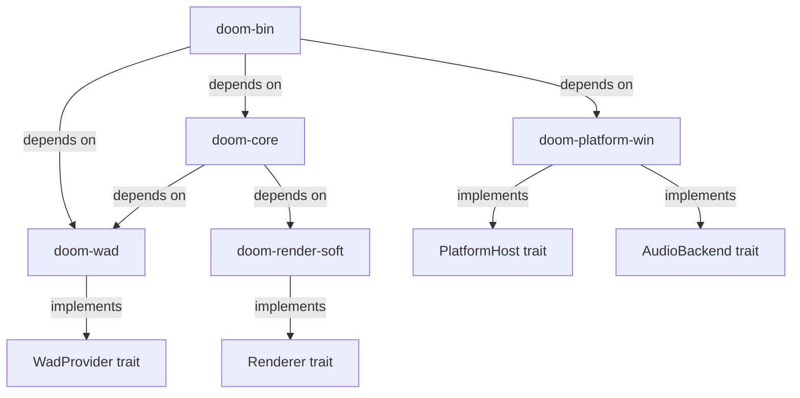

# Architecture Decision Records

This document records the key architectural decisions made during the migration of id Software's DOOM 1.10 engine from its original ANSI C / Linux / X11 implementation to a modern Rust implementation with native Windows 11 support. Each ADR captures the context that motivated the decision, the decision itself, the rationale behind it, and the consequences that follow.

The migration translates approximately 110 C source files (55 `.c` implementation files and 55 `.h` headers) from the `linuxdoom-1.10/` directory, plus the standalone `sndserv/` sound server, into a modular Rust Cargo workspace targeting Windows 11.

## Table of Contents

- [ADR-001 — Platform Backend Choice (SDL2)](#adr-001--platform-backend-choice-sdl2)
- [ADR-002 — Cargo Workspace Crate Organization](#adr-002--cargo-workspace-crate-organization)
- [ADR-003 — Trait-Based Platform Abstraction](#adr-003--trait-based-platform-abstraction)
- [ADR-004 — Fixed-Point Arithmetic Migration](#adr-004--fixed-point-arithmetic-migration)
- [ADR-005 — Zone Memory Replacement](#adr-005--zone-memory-replacement)
- [ADR-006 — Global State Consolidation](#adr-006--global-state-consolidation)
- [ADR-007 — CLI Design](#adr-007--cli-design)
- [ADR-008 — Sound System Architecture](#adr-008--sound-system-architecture)
- [Key Engine Constants Reference](#key-engine-constants-reference)
- [Platform Dependency Mapping](#platform-dependency-mapping)

---

## ADR-001 — Platform Backend Choice (SDL2)

### Context

The original DOOM engine is tightly coupled to a Linux/X11 platform layer. Two candidate replacement stacks were evaluated for the Windows 11 migration:

1. **SDL2** — The `sdl2` Rust crate (version 0.37.0) with the `bundled` feature, providing window management, input handling, audio output, and timing in a single library.
2. **winit + pixels + rodio/cpal** — A pure-Rust stack combining `winit` 0.30.13 for windowing, `pixels` 0.15.0 for GPU-accelerated pixel framebuffers, and `rodio` 0.22.2 (built on `cpal`) for audio playback.

The original platform dependencies that must be replaced are:

| Original Dependency | Source File | Purpose |
|---------------------|-------------|---------|
| X11/Xlib, MIT-SHM extension | `i_video.c` | Display, keyboard/mouse input |
| OSS `/dev/dsp`, SNDSERV pipe | `i_sound.c`, `sndserv/` | Audio output |
| `gettimeofday()` | `i_system.c` | High-resolution timing |
| Unix UDP sockets | `i_net.c` | Multiplayer networking |

### Decision

Use **SDL2 with the `bundled` feature** (`sdl2` crate version 0.37.0) as the unified platform backend for window management, input handling, audio output, and timing on Windows 11.

### Rationale

- **Ecosystem alignment**: The DOOM source port community (Chocolate Doom, PrBoom+, Crispy Doom) standardizes on SDL2, providing proven reference implementations for audio mixing, input mapping, and palette-based rendering at 35 Hz. This provides a well-understood foundation for the migration.
- **Integration simplicity**: SDL2 provides window, input, audio, and timing facilities in a single library, eliminating the need to coordinate version compatibility across three separate crates. The `winit` + `pixels` + `rodio` combination has known `raw-window-handle` trait compatibility issues between `winit` 0.30.x and `pixels` 0.15.0.
- **Windows 11 support**: SDL2's `bundled` feature compiles the SDL2 C library from source during `cargo build`, making the build fully self-contained on Windows 11 without requiring pre-installed system libraries. The only external prerequisite is Visual Studio Build Tools (C++ workload) for the C compilation step.
- **Minimal FFI surface**: The `sdl2` Rust crate wraps SDL2 in safe Rust types. The only FFI is managed internally by `sdl2-sys`, and none of the FFI surface leaks into the game logic crates.
- **Software rendering compatibility**: SDL2's `Surface` and `Texture` APIs support direct pixel buffer manipulation, which is exactly what DOOM's software renderer requires — writing palettized 320×200 frames that get scaled to the window. No GPU shader pipeline is needed.

### Consequences

- The trait-based architecture (see [ADR-003](#adr-003--trait-based-platform-abstraction)) allows future replacement of SDL2 with a pure-Rust stack (winit + pixels + rodio) without modifying any core game logic in `doom-core`.
- The only FFI in the entire project is managed internally by `sdl2-sys`. No `extern "C"` blocks appear in application code.
- SDL2's `bundled` feature adds approximately 30–60 seconds to the first build while compiling the C library from source. Subsequent incremental builds are fast.

### Rejected Alternative

**winit + pixels + rodio** was rejected for the following reasons:

- Known `raw-window-handle` trait compatibility issues between `winit` 0.30.x and `pixels` 0.15.0 require careful version pinning and may break with upstream updates.
- Coordinating three separate libraries (windowing, framebuffer, audio) increases integration complexity compared to SDL2's unified API.
- The DOOM source port community does not use this stack, so there are no reference implementations to validate against.
- `pixels` uses wgpu for GPU-accelerated framebuffer upload, which introduces a shader compilation pipeline that is unnecessary for DOOM's CPU-rendered 320×200 output.

---

## ADR-002 — Cargo Workspace Crate Organization

### Context

The original C codebase is a flat directory of approximately 110 `.c`/`.h` files compiled via GNU Make into a single `linuxxdoom` ELF binary. The original `Makefile` uses:

```
CC    = gcc
CFLAGS = -g -Wall -DNORMALUNIX -DLINUX
LIBS  = -lXext -lX11 -lnsl -lm
```

No module boundaries exist — all translation units share global state through `extern` declarations in header files. Any `.c` file can include any `.h` file and call any function, leading to a tightly coupled monolithic architecture.

### Decision

Organize the Rust port as a **Cargo workspace with 5 member crates**, each with explicit dependency boundaries:

| Crate | Role | Derived From |
|-------|------|-------------|
| `doom-wad` | WAD/IWAD file parsing library | `w_wad.c/h` |
| `doom-core` | Deterministic game logic (types, game loop, play systems, UI, utilities, trait definitions) | `d_*.c/h`, `p_*.c/h`, `g_game.c/h`, UI files, utility files, `doomdef.h` et al. |
| `doom-render-soft` | BSP-based software renderer | `r_*.c/h` |
| `doom-platform-win` | Windows 11 platform backend implementing trait interfaces | `i_video.c`, `i_sound.c`, `i_system.c`, `i_net.c`, `sndserv/` |
| `doom-bin` | Thin executable entry point that wires everything together | `i_main.c` |

### Dependency Graph



### Rationale

- **`doom-wad`** is isolated as the foundational crate because WAD file parsing has no platform dependencies and is needed by both `doom-core` (for game data loading) and potentially by external tools.
- **`doom-core`** contains all deterministic game logic — types, the game loop, play subsystems (physics, AI, map specials), UI systems, utilities, and trait definitions. This is the largest crate, mirroring the fact that the majority of DOOM's source code is platform-independent game logic.
- **`doom-render-soft`** separates the software renderer from the game logic. The renderer is the second-largest subsystem (~22 source files) and has a clear interface boundary: `R_RenderPlayerView()`, `R_Init()`, `R_SetViewSize()`.
- **`doom-platform-win`** isolates all Windows 11 / SDL2 platform-specific code. It implements the traits defined in `doom-core` and absorbs the functionality of the standalone `sndserv/` sound server.
- **`doom-bin`** is a thin entry point crate that constructs the platform backend, initializes the game, and enters the main loop. It replaces the original `i_main.c`.

### Consequences

- Explicit dependency boundaries enforced by Cargo prevent platform code from leaking into game logic. `doom-core` has **no dependency** on `sdl2` or any platform-specific crate.
- The crate structure enables independent testing of each subsystem.
- The workspace replaces the original GNU Make build system. Building the entire project is a single `cargo build --release` command.

---

## ADR-003 — Trait-Based Platform Abstraction

### Context

The original C code uses `i_*.h` header files to define a platform abstraction layer. The following functions form the interface between portable game code and platform-specific implementations:

**From `i_system.h`:**
- `I_Init()` — System initialization
- `I_GetTime()` — Returns current time in tics
- `I_StartFrame()` — Called before processing any tics in a frame
- `I_StartTic()` — Called before processing each tic
- `I_BaseTiccmd()` — Returns a base tic command
- `I_Quit()` — Clean exit
- `I_Error()` — Fatal error handler

**From `i_video.h`:**
- `I_InitGraphics()` — Sets up video mode
- `I_ShutdownGraphics()` — Tears down video
- `I_SetPalette(byte* palette)` — Sets the 256-color palette
- `I_FinishUpdate()` — Presents the frame to the display
- `I_UpdateNoBlit()` — Marks the display as needing update
- `I_ReadScreen(byte* scr)` — Reads the current screen buffer
- `I_WaitVBL(int count)` — Waits for vertical blank

**From `i_sound.h`:**
- `I_InitSound()`, `I_ShutdownSound()` — Sound system lifecycle
- `I_StartSound(id, vol, sep, pitch, priority)` — Starts a sound effect
- `I_StopSound(handle)` — Stops a sound channel
- `I_SoundIsPlaying(handle)` — Queries channel status
- `I_UpdateSoundParams(handle, vol, sep, pitch)` — Updates a playing sound
- `I_UpdateSound()`, `I_SubmitSound()` — Per-frame audio update
- `I_InitMusic()`, `I_ShutdownMusic()` — Music system lifecycle
- `I_PlaySong(handle, looping)`, `I_StopSong(handle)` — Music playback
- `I_SetMusicVolume(volume)` — Music volume control
- `I_PauseSong(handle)`, `I_ResumeSong(handle)` — Music pause/resume
- `I_RegisterSong(data)`, `I_UnRegisterSong(handle)` — Music data registration

**From `i_net.h`:**
- `I_InitNetwork()` — Network initialization
- `I_NetCmd()` — Network command dispatch

In C, this abstraction is enforced by convention only — any file can call any function regardless of which header it was declared in.

### Decision

Define **Rust traits** in `doom-core/src/traits/` that formalize these interfaces:

- **`PlatformHost`** trait (from `i_system.h` + `i_video.h`): `get_time()`, `start_frame()`, `start_tic()`, `init_graphics()`, `finish_update()`, `set_palette()`, `shut_down()`, `read_screen()`, `wait_vbl()`
- **`Renderer`** trait (from `r_main.h`): `render_player_view()`, `init()`, `set_view_size()`
- **`AudioBackend`** trait (from `i_sound.h`): `init_sound()`, `start_sound()`, `stop_sound()`, `update_sound()`, `submit_sound()`, `sound_is_playing()`, `update_sound_params()`, plus music methods (`init_music()`, `play_song()`, `stop_song()`, `set_music_volume()`, `pause_song()`, `resume_song()`, `register_song()`, `unregister_song()`)
- **`WadProvider`** trait (from `w_wad.h`): lump lookup (`check_num_for_name()`, `get_num_for_name()`), lump I/O (`lump_length()`, `read_lump()`), cache interface (`cache_lump_num()`, `cache_lump_name()`)

### Rationale

- **Compile-time enforcement**: Traits enforce the interface contract at compile time, unlike C's convention-based header separation. A game logic module cannot accidentally call a platform-specific function — it can only call methods on trait objects.
- **Backend substitution**: The game logic in `doom-core` depends only on trait types, never on concrete platform implementations. This enables future backend substitution (e.g., a Linux SDL2 backend, a pure-Rust winit + pixels + rodio stack) without modifying `doom-core` or `doom-render-soft`.
- **Testability**: Trait interfaces enable mock implementations for unit testing game logic without initializing SDL2 or audio hardware.

### Consequences

- All platform-specific code is isolated in `doom-platform-win`. No `unsafe` code is needed in `doom-core` for platform interaction.
- Function signatures are more explicit — platform capabilities are passed as trait objects or generic parameters rather than accessed through global function pointers.
- The trait definitions serve as living documentation of the platform interface contract.

---

## ADR-004 — Fixed-Point Arithmetic Migration

### Context

DOOM uses 16.16 fixed-point arithmetic extensively throughout the engine for position tracking, movement physics, rendering calculations, and trigonometric lookups. The original definitions from `m_fixed.h`:

```c
#define FRACBITS    16
#define FRACUNIT    (1<<FRACBITS)    /* = 65536 */

typedef int fixed_t;                 /* signed 32-bit */

fixed_t FixedMul  (fixed_t a, fixed_t b);
fixed_t FixedDiv  (fixed_t a, fixed_t b);
fixed_t FixedDiv2 (fixed_t a, fixed_t b);
```

The implementations from `m_fixed.c`:

```c
fixed_t FixedMul(fixed_t a, fixed_t b)
{
    return ((long long) a * (long long) b) >> FRACBITS;
}

fixed_t FixedDiv(fixed_t a, fixed_t b)
{
    if ((abs(a) >> 14) >= abs(b))
        return (a ^ b) < 0 ? MININT : MAXINT;
    return FixedDiv2(a, b);
}

fixed_t FixedDiv2(fixed_t a, fixed_t b)
{
    double c;
    c = ((double)a) / ((double)b) * FRACUNIT;
    if (c >= 2147483648.0 || c < -2147483648.0)
        I_Error("FixedDiv: divide by zero");
    return (fixed_t) c;
}
```

Assembly inner loops documented in `README.asm` (`R_DrawColumn`, `R_DrawSpan`) also use fixed-point stepping for texture coordinate interpolation.

### Decision

Implement a **`Fixed(i32)` newtype** in `doom-core/src/types/fixed.rs` with method implementations that produce **bit-identical results** to the C versions:

- **`fixed_mul(&self, other: Fixed) -> Fixed`**: Uses `i64` intermediate multiplication:
  ```rust
  Fixed(((self.0 as i64 * other.0 as i64) >> 16) as i32)
  ```
- **`fixed_div(&self, other: Fixed) -> Fixed`**: With the same overflow check as the original:
  ```rust
  if (self.0.unsigned_abs() >> 14) >= other.0.unsigned_abs() {
      return if (self.0 ^ other.0) < 0 { Fixed(i32::MIN) } else { Fixed(i32::MAX) };
  }
  // Fall through to FixedDiv2 equivalent
  ```
- Implement `Add`, `Sub` traits using **wrapping arithmetic** (`wrapping_add`, `wrapping_sub`) where the C code relies on signed integer overflow behavior.
- Define constants: `FRACBITS: i32 = 16`, `FRACUNIT: Fixed = Fixed(1 << 16)`.

### Rationale

- **Overflow semantics**: Rust's default overflow behavior (panic in debug, wrap in release) differs from C's undefined behavior on signed integer overflow. Explicit wrapping operations (`wrapping_add`, `wrapping_sub`) ensure consistent behavior in both debug and release builds, matching the C engine's actual runtime behavior on two's-complement hardware.
- **Intermediate precision**: The `i64` intermediate multiplication in `FixedMul` prevents overflow and is well-defined in both C (`long long`) and Rust (`i64`). The shift-then-truncate pattern `(i64 >> 16) as i32` produces identical results to the C expression `((long long)a * (long long)b) >> FRACBITS`.
- **Newtype safety**: The `Fixed(i32)` newtype pattern prevents accidental mixing of fixed-point values with plain `i32` integers, catching unit errors at compile time.
- **Division via floating-point**: The original `FixedDiv2` uses `double` arithmetic rather than the commented-out integer shift approach. The Rust port preserves this behavior for bit-identical results.

### Consequences

- All game logic, rendering, and physics produce **bit-identical results** to the C implementation, which is critical for demo playback compatibility.
- The `Fixed` newtype adds zero runtime overhead (it is a transparent wrapper around `i32`).
- Assembly inner loops from `README.asm` are reimplemented as standard Rust loops with equivalent fixed-point stepping arithmetic — no `unsafe` or inline assembly required.

---

## ADR-005 — Zone Memory Replacement

### Context

The zone memory allocator (`z_zone.c/h`) implements a custom heap manager that allocates from a single `malloc`'d block (6 MB by default, hardcoded in `i_system.c` as `mb_used = 6`). It supports tagged allocations with purge levels that control automatic memory reclamation.

**Tag definitions from `z_zone.h`:**

| Tag Constant | Value | Behavior |
|-------------|-------|----------|
| `PU_STATIC` | 1 | Never freed automatically — persists for entire execution |
| `PU_SOUND` | 2 | Static while sound is playing |
| `PU_MUSIC` | 3 | Static while music is playing |
| `PU_DAVE` | 4 | Miscellaneous static data (named after Dave Taylor) |
| `PU_LEVEL` | 50 | Freed when the current level is exited |
| `PU_LEVSPEC` | 51 | Level-specific thinkers — freed at level change |
| `PU_PURGELEVEL` | 100 | Threshold: tags ≥ 100 are purgeable whenever needed |
| `PU_CACHE` | 101 | Can be freed at any time to reclaim memory |

The zone uses a doubly-linked list of `memblock_t` structures, each containing:

```c
typedef struct memblock_s {
    int           size;    // including header and fragments
    void**        user;    // NULL if a free block
    int           tag;     // purge level
    int           id;      // should be ZONEID (0x1d4a11)
    struct memblock_s* next;
    struct memblock_s* prev;
} memblock_t;
```

Key zone operations include `Z_Malloc(size, tag, user)`, `Z_Free(ptr)`, `Z_FreeTags(lowtag, hightag)`, and `Z_ChangeTag(ptr, tag)`.

### Decision

Replace the zone allocator with three components:

1. **Standard Rust allocator** for all general allocations — no 6 MB limit, no custom heap block.
2. **`LumpCache`** in `doom-wad/src/lump_cache.rs` implementing the tag-based eviction semantics for WAD lump data. Cache entries are stored in a `HashMap<LumpNum, CachedLump>` where `CachedLump` tracks the purge tag. Entries tagged `PU_CACHE` (101) can be evicted under memory pressure, while `PU_STATIC` (1) entries persist until explicitly freed.
3. **Level-scoped allocations** in `doom-core` — a level context struct that is dropped (and its owned allocations freed via Rust's `Drop` trait) when `P_SetupLevel` is called for a new map. This replaces the `Z_FreeTags(PU_LEVEL, PU_LEVSPEC)` call pattern.

### Rationale

- **Historical context**: The zone allocator was necessary on DOS and early Unix systems where a single large `malloc` call was more reliable than many small allocations, and manual memory management with tag-based eviction was required to fit within tight memory constraints. Modern systems have no such constraint.
- **Safety**: Rust's standard allocator is safe and performant. The zone allocator relies on raw pointer manipulation, linked-list traversal with pointer casting, and magic number validation (`ZONEID = 0x1d4a11`) — all of which would require extensive `unsafe` code in Rust.
- **Behavioral preservation**: The `HashMap`-based lump cache preserves the tag-based eviction contract. Code that expects `PU_CACHE` data to be evictable and `PU_STATIC` data to persist will work identically. Level-scoped allocations are automatically freed when the level context is dropped, matching the `Z_FreeTags(PU_LEVEL, PU_LEVSPEC)` pattern.
- **No memory limit**: The 6 MB hardcoded limit is removed. The Rust allocator uses the system's full available memory.

### Consequences

- Safe, idiomatic Rust without `unsafe` blocks for memory management.
- The WAD lump caching behavior is preserved through the `LumpCache` abstraction.
- No 6 MB memory limit — the engine can handle larger PWAD files and complex maps without running out of zone memory.
- The `Z_CheckHeap()` and `Z_DumpHeap()` diagnostic functions are no longer needed, as Rust's allocator provides its own diagnostics.

---

## ADR-006 — Global State Consolidation

### Context

The original C codebase uses extensive global mutable state via `extern` variables declared in header files and defined in corresponding `.c` files. `doomstat.h/c` alone declares approximately 50 global variables, including:

- `gamemode`, `gamemission`, `language` — IWAD identification
- `gamestate`, `gameaction`, `gameskill` — Current game state
- `gamemap`, `gameepisode`, `gametic`, `leveltime` — Level/timing state
- `consoleplayer`, `displayplayer` — Player identity
- `playeringame[MAXPLAYERS]`, `players[MAXPLAYERS]` — Player data arrays
- `netgame`, `deathmatch` — Network mode flags
- `automapactive`, `menuactive`, `paused` — UI state flags
- `viewactive`, `nodrawers`, `noblit` — Rendering state

Additional globals are scattered across many other files: renderer state in `r_main.c` (viewpoint, lighting LUTs), sound state in `s_sound.c` (channel table, volumes), and platform state in `i_video.c` (X11 display, window handles).

Every subsystem accesses shared globals directly through `extern` declarations, creating implicit coupling between all modules.

### Decision

Consolidate global state into **owned structs passed by mutable reference** through the call chain:

| Struct | Crate | Owns |
|--------|-------|------|
| `GameState` | `doom-core/src/game/` | All formerly-global game variables: mode, state, skill, map, players, timing, flags |
| `RenderState` | `doom-render-soft/src/` | Renderer-specific globals: viewpoint, lighting LUTs, visplane pool, draw segment pool |
| `PlatformState` | `doom-platform-win/src/` | Platform-specific state: SDL2 context, window handle, audio device, input state |

The `doom-bin/src/main.rs` entry point constructs all three state structs and passes them to `D_DoomMain`, which threads them through the game loop.

### Rationale

- **Eliminates `static mut`**: Rust's `static mut` requires `unsafe` for every access. Consolidating state into owned structs avoids this entirely.
- **Borrow checker enforcement**: Passing state by mutable reference (`&mut GameState`) allows the Rust borrow checker to verify that no two subsystems simultaneously hold mutable access to the same state, preventing data races and aliasing bugs.
- **Explicit ownership**: State ownership is visible in function signatures rather than hidden behind `extern` declarations. It is immediately clear which functions can modify game state and which only read it.
- **Testability**: State structs can be constructed with known values for unit testing without relying on global initialization order.

### Consequences

- Function signatures throughout the engine gain explicit state parameters (e.g., `fn p_ticker(state: &mut GameState)` instead of accessing globals directly). This is more verbose but more explicit.
- No `static mut` or interior mutability hacks (e.g., `lazy_static`, `once_cell` with `RefCell`) are needed for game state.
- The initialization order of state is explicit in `main.rs` rather than implicit in C's translation unit linking order.
- Clean separation of concerns: game state, render state, and platform state are owned by different crates and cannot be accidentally cross-referenced.

---

## ADR-007 — CLI Design

### Context

The original DOOM uses C's `argc`/`argv` mechanism with a custom argument parser in `m_argv.c`. The `M_CheckParm(char *check)` function performs a linear scan of the argument array to find flags. Arguments use a single-dash convention:

- `-iwad <path>` — IWAD file path
- `-file <path> [path...]` — PWAD file(s)
- `-warp <episode> <map>` — Warp to a specific map
- `-skill <1-5>` — Set difficulty level
- `-devparm` — Developer mode
- `-nomonsters` — Disable monster spawning
- `-respawn` — Monsters respawn after death

The original `d_main.h` defines `MAXWADFILES = 20` as the limit on simultaneously loaded WAD files.

### Decision

Use **`clap` 4.5** with derive macros for CLI parsing in `doom-bin/src/cli.rs`:

- `--iwad <path>` — Path to IWAD file (required)
- `--pwad <path>` — Path to PWAD file (optional, repeatable)
- `--warp <episode> <map>` — Warp to a specific map
- `--skill <1-5>` — Set difficulty level (1 = I'm Too Young to Die, 5 = Nightmare!)
- `--verbose` — Enable verbose logging (sets `RUST_LOG=debug`)

### Rationale

- **Automatic help generation**: `clap` generates `--help` and `--version` output automatically from the struct definition, providing a professional user experience without manual string formatting.
- **Typed validation**: Arguments are parsed into typed Rust values (e.g., `PathBuf` for file paths, `u8` for skill level) with automatic range validation and meaningful error messages.
- **Modern convention**: Double-dash `--flag` syntax follows the POSIX/GNU convention used by virtually all modern CLI tools, improving discoverability for new users while maintaining functional equivalence with DOOM's original `-flag` convention.
- **Replaces `m_argv.c`**: The custom `M_CheckParm()` linear scan is replaced by `clap`'s efficient parsing with `O(1)` flag lookup after the initial parse.

### Consequences

- Better user experience with auto-generated help text and clear error messages for invalid arguments.
- Standard `--flag` syntax replaces DOOM's original `-flag` convention. This is a minor behavioral change that improves usability.
- The `MAXWADFILES = 20` limit is preserved but enforced through `clap` value validation rather than a fixed-size array.
- Additional original DOOM flags (`-devparm`, `-nomonsters`, `-respawn`, etc.) can be added incrementally as additional `clap` fields.

---

## ADR-008 — Sound System Architecture

### Context

The original DOOM uses two audio models, selected at compile time via preprocessor defines in `doomdef.h`:

1. **`SNDSERV` (default, line 84)**: An external `sndserver` process communicates with the main engine via `FILE*` pipes (stdin/stdout). The engine writes sound commands (start, stop, update) to the pipe; the sound server reads them, loads sound lumps from the WAD file via its own `wadread.c` WAD reader, mixes audio samples, and writes the mixed output to `/dev/dsp` via the OSS (Open Sound System) interface in `linux.c`. The `sndserv/` directory contains the complete sound server: `soundsrv.c` (main loop), `linux.c` (OSS `/dev/dsp` backend), `wadread.c/h` (minimal WAD reader), `sounds.c/h` (sound info tables), and `soundst.h` (shared types).

2. **`SNDINTR` (experimental, line 85, commented out)**: An in-process model using timer interrupts at 500μs intervals for audio mixing. Marked as experimental and incomplete in the source — the `#define SNDINTR 1` line is commented out by default.

The high-level sound API in `i_sound.h` defines the interface used by the game logic in `s_sound.c`:

- SFX: `I_InitSound()`, `I_StartSound(id, vol, sep, pitch, priority)`, `I_StopSound(handle)`, `I_SoundIsPlaying(handle)`, `I_UpdateSoundParams(handle, vol, sep, pitch)`, `I_UpdateSound()`, `I_SubmitSound()`
- Music: `I_InitMusic()`, `I_PlaySong(handle, looping)`, `I_StopSong(handle)`, `I_SetMusicVolume(volume)`, `I_PauseSong(handle)`, `I_ResumeSong(handle)`, `I_RegisterSong(data)`, `I_UnRegisterSong(handle)`

### Decision

Replace both the `SNDSERV` pipe model and the experimental `SNDINTR` timer model with **SDL2 callback-based audio mixing** in `doom-platform-win/src/audio.rs`. Implement the `AudioBackend` trait (defined in `doom-core/src/traits/audio.rs`) with methods matching the original `i_sound.h` interface.

The SDL2 `AudioDevice` is configured with a callback function that mixes active sound channels at the hardware's sample rate. Sound effects are mixed from the raw PCM data stored in WAD lumps (format: 8-bit unsigned mono, 11025 Hz). Music playback uses the same SDL2 audio callback for MUS-format data.

### Rationale

- **Platform specificity**: The pipe-based `SNDSERV` model is fundamentally Linux-specific — it relies on Unix process creation (`fork`/`exec`), Unix pipes (`popen`), and the OSS `/dev/dsp` device. None of these exist on Windows 11.
- **Low latency**: SDL2's `AudioDevice` with a callback-based mixing model provides lower latency than the pipe-based model, as there is no inter-process communication overhead.
- **Simplicity**: An in-process audio mixer eliminates the need for a separate binary, simplifying the build and deployment.
- **Proven approach**: SDL2's audio API is used by Chocolate Doom, PrBoom+, and other DOOM source ports, validating its suitability for DOOM's audio requirements.

### Consequences

- No separate `sndserver` binary is needed. The build produces a single executable.
- Audio mixing is in-process, running in a dedicated audio thread managed by SDL2.
- The `sndserv/` directory is preserved in the repository as a historical reference but is not compiled or linked.
- The `AudioBackend` trait interface ensures that the audio implementation can be replaced without modifying game logic in `s_sound.c` (now `doom-core/src/info/sounds.rs` and related modules).

---

## Key Engine Constants Reference

The following constants define the behavioral contract that is preserved exactly in the Rust port. These values must not be changed, as they are deeply embedded in the game's physics, rendering, and timing systems.

| Constant | Value | Original Source | Significance |
|----------|-------|----------------|--------------|
| `VERSION` | 110 | `doomdef.h` | Engine version identifier |
| `SCREENWIDTH` | 320 | `doomdef.h` | Native render buffer width in pixels |
| `SCREENHEIGHT` | 200 | `doomdef.h` | Native render buffer height in pixels |
| `TICRATE` | 35 | `doomdef.h` | Game simulation ticks per second |
| `MAXPLAYERS` | 4 | `doomdef.h` | Maximum simultaneous players |
| `FRACBITS` | 16 | `m_fixed.h` | Fixed-point fractional bit count |
| `FRACUNIT` | 65536 | `m_fixed.h` | Fixed-point unit value (1 << 16) |
| `LIGHTLEVELS` | 16 | `r_main.h` | Diminishing brightness lighting gradations |
| `NUMCOLORMAPS` | 32 | `r_main.h` | Colormap LUT entries in COLORMAP lump |
| `MAXLIGHTSCALE` | 48 | `r_main.h` | Maximum light scaling steps |
| `MAXLIGHTZ` | 128 | `r_main.h` | Maximum depth-based light steps |

---

## Platform Dependency Mapping

The following table maps each original Linux/Unix platform dependency to its Windows 11 replacement in the Rust port.

| Component | Original (Linux) | Replacement (Windows 11) |
|-----------|-------------------|--------------------------|
| Display | X11/Xlib, MIT-SHM extension | SDL2 `Window`, `Canvas`, `Texture` |
| Audio | OSS `/dev/dsp`, SNDSERV pipe to external `sndserver` process | SDL2 `AudioDevice` with callback-based mixing |
| Timing | `gettimeofday()` | `std::time::Instant` / SDL2 timer |
| Networking | Unix UDP sockets (`socket`, `bind`, `sendto`, `recvfrom`) | `std::net::UdpSocket` (deferred — single-player stub) |
| Entry point | Unix `main(argc, argv)` | Rust `fn main()` with `clap` CLI parsing |
| Build system | GNU Make + GCC (`-DNORMALUNIX -DLINUX`, `-lXext -lX11 -lnsl -lm`) | Cargo workspace (`cargo build --release`) |
| Memory management | Zone allocator (`z_zone.c`, 6 MB `malloc`'d heap) | Rust standard allocator + `HashMap`-based lump cache |
